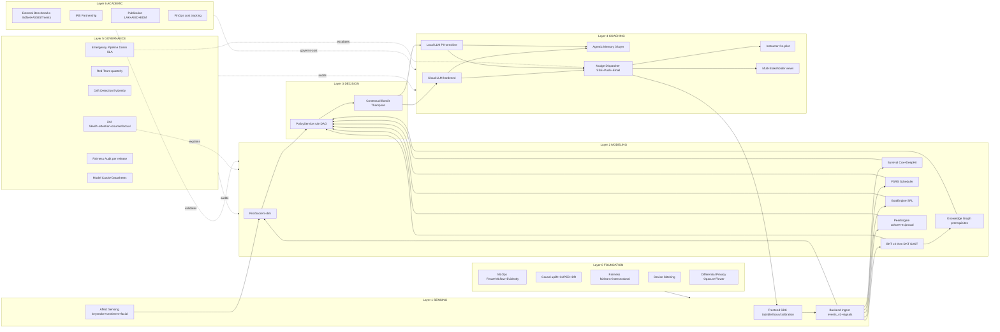
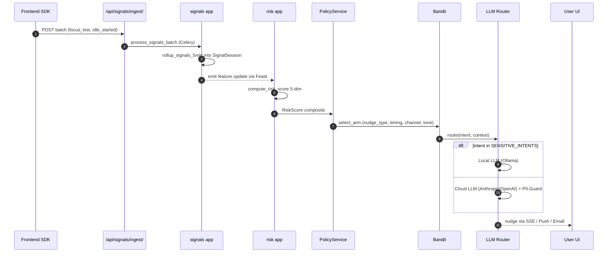
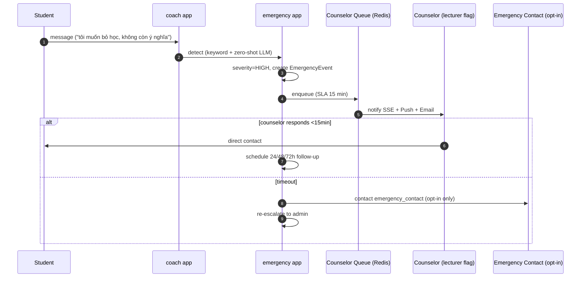
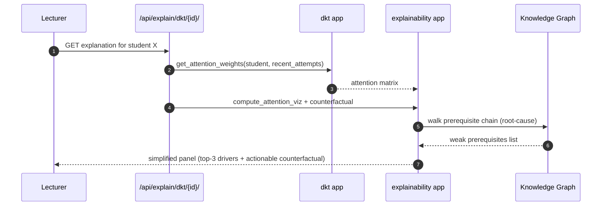

# AI-Coach Architecture — PALP v3.0

> Tài liệu kiến trúc cho roadmap nâng cấp PALP thành AI-Coach đa-tín-hiệu state-of-the-art, plan v3 (7 phase, 12 tháng). Đọc trước mọi tài liệu chuyên đề khác trong thư mục này.

## 1. Mục tiêu nghiệp vụ

Giải quyết 4 vấn đề hành vi sinh viên (mất định hướng, phân tâm, năng lực kém, bị nhóm kéo xuống) cộng với 6 vấn đề kỹ thuật-pháp lý (no science foundation, no safety net, black-box AI, no spaced retention, privacy at scale, no academic credibility, lecturer/parent bị bỏ rơi).

| Vấn đề | Phase giải quyết |
|---|---|
| Mất định hướng | P2 Direction + SRL grounding |
| Phân tâm | P1 Sensing + P5 Bandit |
| Năng lực thấp | P1 BKT v2 + P5 DKT/SAKT + KG |
| Bị nhóm kéo xuống | P3 Anti-Herd + Reciprocal Teaching |
| Lớp ngôn ngữ + dialog | P4 Hybrid Coach + P5 Agentic Memory |
| Không science foundation | P0 Foundation Science |
| Không safety net | P4 Emergency + Hardening |
| Black-box AI (legal risk) | P6A XAI Layer |
| Long-term retention | P6B FSRS + Cognitive Load + ZPD |
| Privacy ở scale lớn | P6C Differential Privacy + Federated |
| Affect mù | P6D Multi-Modal Affect |
| Không academic credibility | P6E External Benchmarks + IRB |
| Stakeholder bị bỏ rơi | P6F Instructor Co-pilot + Multi-Stakeholder |

## 2. Kiến trúc 7 layer

## 3. 8 nguyên tắc bất di bất dịch

1. **Decision-deterministic-first** — risk, BKT/DKT, pathway, peer match, FSRS đều rule/ML in-house, audit được. LLM là "lớp ngôn ngữ".
2. **Privacy-first dual-LLM + DP** — PII-sensitive chỉ Local LLM. Aggregated analytics qua DP noise. Federated optional cho multi-trường.
3. **Backward-compat additive-only** — 19+ apps mới; không sửa contract cũ. Dual-write per [migration-runbook](MIGRATION_RUNBOOK.md).
4. **Causal-not-correlational** — không ship feature nào không có A/B với uplift estimator (P0). External benchmarks SOTA validate (P6).
5. **SDT-aligned, no extrinsic gamification** — Self-Determination Theory. Cấm tuyệt đối points/badges/leaderboard/streak. Xem [MOTIVATION_DESIGN.md](MOTIVATION_DESIGN.md).
6. **Fairness-by-design** — mọi clustering/recommendation/risk model qua fairness audit per release. CI gate fail-build.
7. **Explainable-by-default** — mọi ML decision có explanation interface (SHAP/attention/counterfactual). GDPR Art.22 + NĐ 13/2023.
8. **Multi-stakeholder coverage** — không bỏ rơi stakeholder nào: student, lecturer, content creator, admin, parent/sponsor. Xem [MULTISTAKEHOLDER_GUIDE.md](MULTISTAKEHOLDER_GUIDE.md).

## 4. App topology — 19 apps mới + extension apps cũ

### Apps mới (sẽ tạo)

| Phase | App path | Vai trò chính |
|---|---|---|
| P0 | `backend/mlops/` | Feature store, MLflow tracking, drift detection, shadow deployment, model registry |
| P0 | `backend/causal/` | A/B with uplift modeling, CUPED, doubly-robust |
| P0 | `backend/fairness/` | Demographic parity, equalized odds, intersectional audit, CI gate |
| P0 | `backend/sessions/` | Device fingerprint, multi-device session linking |
| P1 | `backend/signals/` | Behavioral signal ingest, rollup, scoring |
| P1 | `backend/risk/` | RiskScoreService 5-dim weighted |
| P2 | `backend/goals/` | Zimmerman SRL 3-phase cycle |
| P3 | `backend/peer/` | Cohort, reciprocal matching, herd cluster, frontier mode |
| P4 | `backend/coach/` | LLM orchestration, dual routing, memory, tools |
| P4 | `backend/emergency/` | Detection, counselor queue, escalation, follow-up |
| P4 | `backend/notifications/` | SSE + Web Push + Email dispatcher |
| P5 | `backend/dkt/` | SAKT/AKT transformer Deep Knowledge Tracing |
| P5 | `backend/bandit/` | Thompson sampling contextual MAB |
| P5 | `backend/survival/` | Cox PH + DeepHit dropout prediction |
| P6 | `backend/explainability/` | SHAP + attention + counterfactual |
| P6 | `backend/spacedrep/` | FSRS scheduler, CLT tuning, ZPD scaffolding |
| P6 | `backend/privacy_dp/` | Opacus DP-SGD, Flower federated |
| P6 | `backend/affect/` | Keystroke + linguistic + facial (on-device) |
| P6 | `backend/instructor_copilot/` | Auto-generate, grade, feedback drafts |

### Apps cũ được mở rộng (KHÔNG break contract)

| App | Phase | Mở rộng |
|---|---|---|
| `backend/events/` | P1 | +25 event_name, JSON schema folder |
| `backend/adaptive/` | P1 | `update_mastery_v2` shadow vs v1, `p_mastery_v2` field |
| `backend/curriculum/` | P5 | `ConceptPrerequisite` table, root-cause analyzer |
| `backend/dashboard/` | P1 | RiskScore là signal thứ 5 trong `compute_early_warnings` |
| `backend/privacy/` | All | +14 consent types, audit prefix mở rộng |
| `backend/wellbeing/` | P4 | Integrate với Emergency + CoachTrigger |
| `backend/accounts/` | P4/P6 | `counselor_certified` flag, parent/content_creator roles |

## 5. Data flow chính (sequence diagrams)

### 5.1 Sensing → Risk → Coach nudge

### 5.2 Emergency escalation

### 5.3 DKT inference + XAI explanation

## 6. Tech stack additions

| Layer | Tech mới | Vai trò |
|---|---|---|
| ML | PyTorch 2.x + Opacus | DKT/SAKT, Survival DeepHit, DP-SGD |
| ML | causalml + dowhy + lifelines | Uplift, survival |
| ML | fairlearn + Evidently | Fairness + drift |
| ML | Feast + MLflow | Feature store + tracking |
| ML | sentence-transformers + pgvector | Embedding cho memory |
| LLM | Ollama (vLLM cho prod scale) | Local LLM |
| LLM | Anthropic SDK + OpenAI SDK | Cloud LLM (provider-agnostic) |
| LLM | spaCy + Vietnamese NER (PhoBERT) | PII guard + sentiment |
| Frontend | MediaPipe Face Landmarker | On-device facial affect |
| Frontend | React Flow | KG graph visualization |
| Notification | django-eventstream + pywebpush | SSE + Web Push |
| Federated | Flower | Multi-trường DKT |

Tất cả thêm vào [`backend/requirements.txt`](../backend/requirements.txt) và [`frontend/package.json`](../frontend/package.json) theo nguyên tắc 4 ([AGENTS.md](../AGENTS.md)).

## 7. Phase gates summary

Xem chi tiết trong [DEFINITION_OF_DONE.md](DEFINITION_OF_DONE.md) section "Phase Gates v3".

| Phase | Tuần | Gate criteria tóm tắt |
|---|---|---|
| P0 | 1-4 | MLflow+Feast+Evidently prod, fairness CI integrated |
| P1 | 5-12 | Ingest p95<100ms, risk-GPA r≥0.4, fairness pass |
| P2 | 13-19 | ≥30% sv reflection, drift precision≥75% |
| P3 | 20-27 | Reciprocal accept≥40%, fairness clustering pass |
| P4 | 28-37 | Hallucination<2%, emergency SLA>95%@15min |
| P5 | 38-45 | DKT uplift≥15%, KG root-cause≥70%, GA v2.0 |
| P6 | 46-58 | XAI≥85%, FSRS uplift≥20%, ε≤1.0, IRB approved, GA v3.0 |

## 8. Đọc tiếp

- [SIGNAL_TAXONOMY.md](SIGNAL_TAXONOMY.md) — chi tiết 25+ event mới
- [LEARNING_SCIENCE_FOUNDATIONS.md](LEARNING_SCIENCE_FOUNDATIONS.md) — multi-theory mapping
- [MOTIVATION_DESIGN.md](MOTIVATION_DESIGN.md) — SDT principles, anti-gamification
- [PEER_ENGINE_DESIGN.md](PEER_ENGINE_DESIGN.md) — anti-herd + reciprocal teaching
- [COACH_SAFETY_PLAYBOOK.md](COACH_SAFETY_PLAYBOOK.md) — LLM guardrails
- [PRIVACY_V2_DPIA.md](PRIVACY_V2_DPIA.md) — 14 consent types DPIA
- [EMERGENCY_RESPONSE_TRAINING.md](EMERGENCY_RESPONSE_TRAINING.md) — pipeline + training
- [RED_TEAM_PLAYBOOK.md](RED_TEAM_PLAYBOOK.md) — quarterly LLM security
- [DIFFERENTIAL_PRIVACY_SPEC.md](DIFFERENTIAL_PRIVACY_SPEC.md) — DP spec + epsilon budget
- [COLD_START_PLAYBOOK.md](COLD_START_PLAYBOOK.md) — new/transfer/returning
- [INCIDENT_CULTURE.md](INCIDENT_CULTURE.md) — postmortem + disclosure
- [MULTISTAKEHOLDER_GUIDE.md](MULTISTAKEHOLDER_GUIDE.md) — role guide
- [PUBLICATION_ROADMAP.md](PUBLICATION_ROADMAP.md) — academic publication plan
- [model_cards/README.md](model_cards/README.md) — Model Cards template
