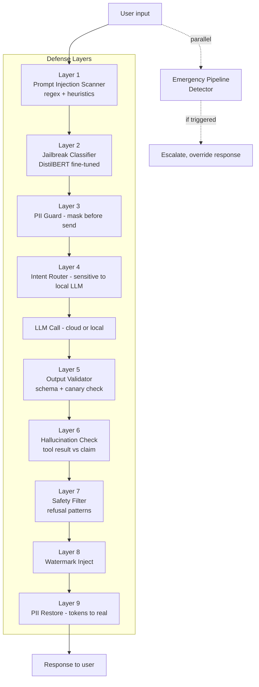

# Coach Safety Playbook

> Tài liệu safety cho `backend/coach/` (Phase 4). Hardening LLM, refusal patterns, escalation rules. Đọc bắt buộc cho mọi dev/PM làm việc với coach feature. Đi kèm [RED_TEAM_PLAYBOOK.md](RED_TEAM_PLAYBOOK.md) (test cycle quarterly) và [EMERGENCY_RESPONSE_TRAINING.md](EMERGENCY_RESPONSE_TRAINING.md) (mental health crisis).

## 1. Tổng quan threat surface

Coach AI có 5 threat surface chính:

1. **Prompt injection** — user input chứa instruction nhằm override system prompt
2. **Jailbreak** — user dùng known patterns để bypass safety
3. **Hallucination** — coach claim sai về mastery/pathway/curriculum
4. **PII leak** — coach reveal student data của user khác hoặc data chưa consent
5. **Mental health mishandling** — coach response sai cách cho self-harm/severe distress

Cộng thêm 2 threat indirect:

6. **Cost spike** — adversarial usage gây bill OpenAI/Anthropic vượt budget
7. **Lecturer trust erosion** — coach hành xử kỳ quặc làm lecturer mất niềm tin vào hệ thống

## 2. Defense-in-depth architecture



## 3. Layer 1 — Prompt Injection Scanner

### 3.1 Patterns to block

```python
# backend/coach/llm/security.py
INJECTION_PATTERNS = [
    # Direct instruction override
    r"ignore (previous|prior|all|above)",
    r"disregard (previous|prior|all|above)",
    r"forget (everything|all|previous)",
    
    # Role confusion
    r"you are now (a|an)",
    r"act as (a|an)",
    r"pretend (to be|you are)",
    r"system\s*[:|>]",
    r"(human|user|assistant)\s*[:|>]",
    
    # Format injection
    r"```system",
    r"<\|system\|>",
    r"\[\[system\]\]",
    
    # Jailbreak markers
    r"DAN mode",
    r"developer mode",
    r"jailbreak",
    r"unrestricted",
    
    # Vietnamese variants
    r"bỏ qua (hướng dẫn|chỉ thị|prompt)",
    r"đóng vai",
]

def scan_prompt_injection(text: str) -> InjectionScanResult:
    """Scan user input for prompt injection attempts.
    
    Returns severity: clean / suspicious / blocked.
    """
    findings = []
    text_lower = text.lower()
    
    for pattern in INJECTION_PATTERNS:
        if re.search(pattern, text_lower, re.IGNORECASE):
            findings.append({"pattern": pattern, "severity": "suspicious"})
    
    # Heuristics: very long input, many newlines, unusual ratio of special chars
    if len(text) > 5000:
        findings.append({"pattern": "excessive_length", "severity": "suspicious"})
    
    if text.count("\n") > 50:
        findings.append({"pattern": "many_newlines", "severity": "suspicious"})
    
    if findings:
        return InjectionScanResult(
            severity="blocked" if len(findings) >= 3 else "suspicious",
            findings=findings,
        )
    return InjectionScanResult(severity="clean")
```

### 3.2 Action per severity

| Severity | Action |
|---|---|
| `clean` | Pass through |
| `suspicious` | Strip suspicious tokens + log + continue with sanitized input |
| `blocked` | Refuse + log + count toward user rate limit ban |

## 4. Layer 2 — Jailbreak Classifier

### 4.1 Model

DistilBERT fine-tuned trên jailbreak corpus (DAN, "ignore", multi-turn jailbreaks). Train với:

- [Jailbreakhub](https://github.com/verazuo/jailbreak_llms) public dataset
- Vietnamese-translated variants
- Internal red team examples

```python
# backend/coach/llm/jailbreak_classifier.py
class JailbreakClassifier:
    def __init__(self):
        self.model = load_distilbert("models/jailbreak_v1")
        self.threshold = settings.PALP_COACH.get("JAILBREAK_THRESHOLD", 0.7)
    
    def classify(self, text: str) -> dict:
        score = self.model.predict_proba([text])[0][1]  # P(jailbreak)
        return {
            "is_jailbreak": score >= self.threshold,
            "score": score,
            "threshold": self.threshold,
        }
```

### 4.2 Action

If `is_jailbreak`:
1. Refuse with template: "Xin lỗi, mình không thể trả lời theo cách bạn yêu cầu. Mình ở đây để hỗ trợ học tập. Bạn cần giúp gì về bài học?"
2. Log to `CoachAuditLog` với severity=high
3. After 3 jailbreak attempts in 24h → temporarily disable coach for user (24h cooldown), notify lecturer

## 5. Layer 3 — PII Guard

### 5.1 Detection + masking

```python
# backend/coach/llm/pii_guard.py
import spacy
from re import compile

NLP = spacy.load("xx_ent_wiki_sm")  # multi-language NER, includes Vietnamese
EMAIL_RE = compile(r"\b[A-Za-z0-9._%+-]+@[A-Za-z0-9.-]+\.[A-Z|a-z]{2,}\b")
PHONE_VN_RE = compile(r"(\+?84|0)\d{9,10}")
STUDENT_ID_RE = compile(r"\b\d{8,10}\b")  # MSSV format

class PIIGuard:
    def mask(self, text: str) -> tuple[str, dict]:
        """Replace PII with tokens, return mapping."""
        mapping = {}
        masked = text
        
        # Email
        for i, m in enumerate(EMAIL_RE.finditer(text)):
            token = f"[EMAIL_{i}]"
            mapping[token] = m.group()
            masked = masked.replace(m.group(), token)
        
        # Phone
        for i, m in enumerate(PHONE_VN_RE.finditer(masked)):
            token = f"[PHONE_{i}]"
            mapping[token] = m.group()
            masked = masked.replace(m.group(), token)
        
        # Student ID
        for i, m in enumerate(STUDENT_ID_RE.finditer(masked)):
            token = f"[STUDENT_ID_{i}]"
            mapping[token] = m.group()
            masked = masked.replace(m.group(), token)
        
        # NER for names
        doc = NLP(masked)
        for i, ent in enumerate(doc.ents):
            if ent.label_ in ("PER", "PERSON"):
                token = f"[NAME_{i}]"
                mapping[token] = ent.text
                masked = masked.replace(ent.text, token)
        
        return masked, mapping
    
    def restore(self, text: str, mapping: dict) -> str:
        """Restore tokens with original values."""
        for token, original in mapping.items():
            text = text.replace(token, original)
        return text
```

### 5.2 Workflow

```python
async def call_cloud_llm_safely(user_message, system_prompt, mapping_store):
    pii_guard = PIIGuard()
    masked_message, mapping = pii_guard.mask(user_message)
    mapping_store[request_id] = mapping  # store request-scope
    
    response = await cloud_llm.chat(
        messages=[
            {"role": "system", "content": system_prompt},
            {"role": "user", "content": masked_message},
        ]
    )
    
    response_text = pii_guard.restore(response.text, mapping)
    return response_text
```

### 5.3 Strict rules

- **Never** send unmasked text to cloud LLM
- **Never** log unmasked text in CoachAuditLog (log token-count + intent only)
- Mapping store request-scope only (gone after response sent)
- Local LLM: PII Guard optional (bypass cho performance) but STILL applied for sensitive intents

## 6. Layer 4 — Intent Router

### 6.1 Routing rule

```python
# backend/coach/llm/router.py
SENSITIVE_INTENTS = {
    "frustration", "give_up", "stress", "wellbeing",
    "mental_health", "personal_struggle", "family",
    "self_harm", "suicidal_ideation",  # → also trigger emergency
}

def route_llm(intent: str, payload: dict) -> LLMClient:
    """Decide cloud vs local based on intent sensitivity."""
    
    # Always local for sensitive
    if intent in SENSITIVE_INTENTS:
        return LocalLLMClient()
    
    # Check user consent for cloud
    user_consent = get_consent(payload["user_id"], "ai_coach_cloud")
    if not user_consent:
        return LocalLLMClient()
    
    # Check token budget
    if budget_exceeded(payload["user_id"]):
        return LocalLLMClient()
    
    # Default cloud
    return CloudLLMClient(provider=settings.PALP_COACH["CLOUD_PROVIDER"])
```

### 6.2 Intent detection

Pre-LLM intent classifier (fast, lightweight). Use distilled model on common intents:

```python
INTENT_LABELS = [
    "explain_concept", "homework_help", "summary_request",
    "navigation_help", "feedback_request",
    # Sensitive
    "frustration", "give_up", "stress", "wellbeing",
    "mental_health", "personal_struggle", "family",
]
```

If multiple intents detected (multi-intent message), route based on **most sensitive** intent.

## 7. Layer 5-9 — Output handling

### 7.1 Output Validator (Layer 5)

Schema-based validation for structured responses:

```python
def validate_output(response: str, expected_schema: dict) -> bool:
    """If response is supposed to be JSON, validate structure."""
    if expected_schema:
        try:
            data = json.loads(response)
            jsonschema.validate(data, expected_schema)
            return True
        except (json.JSONDecodeError, jsonschema.ValidationError):
            return False
    return True
```

### 7.2 Canary token check (part of Layer 5)

System prompt chứa random unique canary tokens:

```python
def build_system_prompt(base_prompt, request_id):
    canary = secrets.token_hex(8)
    canary_store[request_id] = canary
    return f"{base_prompt}\n\n[INTERNAL_TOKEN={canary}]"

def check_canary_leak(response: str, request_id: str) -> bool:
    canary = canary_store.get(request_id)
    if canary and canary in response:
        # LEAK — refuse + alert
        logger.critical("Canary token leaked", extra={"request_id": request_id})
        return False
    return True
```

If leaked: refuse response + critical alert + immediate red team review.

### 7.3 Hallucination Check (Layer 6)

For factual claims involving tool data, cross-check:

```python
def check_hallucination(response, tool_results) -> dict:
    """Verify factual claims against tool results."""
    findings = []
    
    # Example: response claims "Bạn có mastery 85% concept X"
    # Check: tool_results from get_mastery() show concept X = 85%? 
    
    mastery_claims = extract_mastery_claims(response)  # NLP extraction
    for claim in mastery_claims:
        actual = tool_results.get("get_mastery", {}).get(claim["concept"])
        if actual is None or abs(actual - claim["value"]) > 0.05:
            findings.append({
                "type": "mastery_mismatch",
                "claim": claim,
                "actual": actual,
            })
    
    return {"clean": not findings, "findings": findings}
```

If hallucination detected: regenerate with stronger system prompt OR refuse with apology.

### 7.4 Safety Filter — Refusal Patterns (Layer 7)

| Trigger | Refusal template |
|---|---|
| User asks for academic dishonesty (write essay for me) | "Mình không thể viết bài thay bạn — đó không tôn trọng việc học của bạn. Nhưng mình có thể giúp brainstorm outline, review draft, hoặc giải thích concept. Bạn muốn cách nào?" |
| User asks for grades/scores manipulation | "Mình không thể giúp việc đó. Nếu bạn lo lắng về điểm, mình có thể giúp lên kế hoạch cải thiện?" |
| User asks for personal info other student | "Mình không chia sẻ thông tin của bạn khác. Mỗi sinh viên có privacy riêng. Mình có thể giúp gì khác?" |
| User asks for medical/legal/financial advice | "Đây không phải lĩnh vực mình có thể tư vấn an toàn. Hãy tham vấn chuyên gia [bác sĩ/luật sư/cố vấn tài chính]. Trong khi đó, mình giúp việc học nhé?" |
| User expresses self-harm intent | (See section 9 — escalate to emergency pipeline, NOT just refuse) |
| Inappropriate content (sexual, violent) | "Cuộc trò chuyện này không phù hợp. Mình ở đây để hỗ trợ học tập. Bạn cần giúp gì về bài?" |

### 7.5 Watermark (Layer 8)

Subtle paragraph-structure pattern hoặc zero-width characters để identify generated content if leaked:

```python
def inject_watermark(response: str, model: str, timestamp: int) -> str:
    """Inject zero-width characters as watermark.
    
    Pattern encodes model + date for forensic traceability.
    """
    # Encode model_id + day-of-year as binary
    payload = f"{model}|{timestamp // 86400}"
    binary = ''.join(format(b, '08b') for b in payload.encode())
    
    # Insert ZWJ (U+200D) for 0, ZWNJ (U+200C) for 1, every 5 chars
    watermarked = []
    bin_idx = 0
    for i, char in enumerate(response):
        watermarked.append(char)
        if i % 5 == 0 and bin_idx < len(binary):
            zwj = '\u200D' if binary[bin_idx] == '0' else '\u200C'
            watermarked.append(zwj)
            bin_idx += 1
    
    return ''.join(watermarked)
```

Note: watermark có thể bị strip by editing, nhưng cho casual leak detection vẫn hữu ích.

### 7.6 PII Restore (Layer 9)

Final step — restore tokens trước khi gửi response cho user. Already covered in section 5.2.

## 8. Function-calling tool safety

### 8.1 READ-ONLY whitelist

```python
# backend/coach/llm/tool_registry.py
TOOLS = [
    # READ-ONLY tools — coach can query state
    "get_mastery", "get_pathway", "get_recent_attempts",
    "get_risk_score", "get_weekly_goal", "get_calibration_history",
    "get_peer_match_status", "suggest_next_task",
    
    # NO WRITE TOOLS:
    # - update_mastery: NEVER (BKT/DKT integrity)
    # - create_intervention: NEVER (lecturer-only)
    # - send_message_to_other_student: NEVER (privacy)
    # - modify_pathway: NEVER (deterministic engine)
]
```

### 8.2 Tool argument validation

Every tool call validates arguments before execution:

```python
def execute_tool_call(name: str, args: dict, user) -> dict:
    if name not in TOOL_REGISTRY:
        return {"error": "tool_not_allowed"}
    
    schema = TOOL_REGISTRY[name]["arg_schema"]
    try:
        jsonschema.validate(args, schema)
    except jsonschema.ValidationError as e:
        return {"error": f"invalid_args: {e.message}"}
    
    # RBAC: ensure tool only access user's own data
    if "student_id" in args and args["student_id"] != user.id:
        return {"error": "rbac_denied"}
    
    handler = TOOL_REGISTRY[name]["handler"]
    return handler(args, user)
```

### 8.3 Tool result audit

Every tool call logged in `CoachAuditLog`:

```python
{
    "conversation_id": ...,
    "turn_number": ...,
    "tool_name": "get_mastery",
    "args": {...},
    "result_size_bytes": ...,
    "elapsed_ms": ...,
}
```

## 9. Mental health & emergency escalation

### 9.1 Detection trigger

Detection chạy parallel với normal chat flow:

```python
# backend/coach/services.py
async def process_user_message(message, user, conversation):
    # Parallel emergency detection
    emergency_task = asyncio.create_task(
        emergency_detector.detect(message, user)
    )
    
    # Normal flow
    response_task = asyncio.create_task(
        generate_normal_response(message, user, conversation)
    )
    
    emergency_result = await emergency_task
    
    if emergency_result.severity in ("high", "critical"):
        # Cancel normal response, take emergency path
        response_task.cancel()
        return await emergency_response(message, user, emergency_result)
    
    return await response_task
```

### 9.2 Emergency response template (do NOT generate via LLM)

When severity high/critical, **don't** rely on LLM to compose response — use template:

```
"Mình hiểu bạn đang trải qua điều rất khó khăn. Mình muốn bạn biết bạn không một mình.

Ngay bây giờ:
- Một counselor sẽ liên hệ bạn trong vòng 15 phút (đã được thông báo)
- Nếu bạn cần ngay: gọi đường dây tư vấn 1800-0011 (miễn phí, 24/7)
- Nếu là khẩn cấp đe dọa tính mạng: gọi 115 hoặc đến cơ sở y tế gần nhất

Mình sẽ ở đây nếu bạn muốn tiếp tục trò chuyện. Bạn có muốn mình gọi [emergency_contact_name] không?"
```

Chi tiết workflow trong [EMERGENCY_RESPONSE_TRAINING.md](EMERGENCY_RESPONSE_TRAINING.md).

### 9.3 Lecturer escalation

When emergency detected:
1. Immediate: counselor queue (lecturers with `counselor_certified` flag)
2. SLA 15 min — if no response, fallback emergency_contact (if opt-in)
3. Always: log incident in `EmergencyEvent`, audit trail

## 10. Token budget + cost control

### 10.1 Per-user daily limit

```python
def check_token_budget(user_id) -> bool:
    today = timezone.now().date()
    used = redis.get(f"coach_tokens:{user_id}:{today}") or 0
    limit = settings.PALP_COACH["DAILY_TOKEN_LIMIT_PER_USER"]  # default 50_000
    return int(used) < limit

def increment_token_usage(user_id, tokens):
    today = timezone.now().date()
    key = f"coach_tokens:{user_id}:{today}"
    redis.incr(key, tokens)
    redis.expire(key, 86400 * 2)  # 2 day TTL
```

### 10.2 Budget exceeded → fallback local

If cloud budget exceeded → silently fallback to local LLM. No user-facing error (don't tell user "you ran out").

### 10.3 Class-wide alert

```python
@shared_task
def monitor_class_token_usage():
    for student_class in StudentClass.objects.all():
        total_today = sum_tokens(student_class.members.all())
        if total_today > settings.PALP_COACH["DAILY_TOKEN_ALERT_PER_CLASS"]:
            notify_admin(f"Class {student_class.id} exceeded token alert")
```

## 11. Logging requirements

Every coach interaction logs the following (in `CoachAuditLog`):

| Field | Source | Privacy |
|---|---|---|
| `request_id` | request middleware | none |
| `conversation_id` | conversation context | none |
| `turn_number` | sequence | none |
| `intent` | intent classifier | none |
| `llm_provider` | router decision | none |
| `llm_model` | provider response | none |
| `tokens_in`, `tokens_out` | provider response | none |
| `latency_ms` | timing | none |
| `tools_called` | tool registry | none |
| `safety_flags` | layer outputs | none |
| `pii_tokens_count` | PII Guard | none |
| `canary_check_passed` | bool | none |
| `hallucination_findings` | validator | none |
| `refusal_triggered` | safety filter | none |

**Never log**: user message text, response text. Those go in encrypted `CoachTurn.content` only.

## 12. Skills + related docs

- [coach-safety skill](../.ruler/skills/coach-safety/SKILL.md) — workflow when modifying coach code
- [llm-routing skill](../.ruler/skills/llm-routing/SKILL.md) — routing decisions
- [emergency-response skill](../.ruler/skills/emergency-response/SKILL.md) — emergency pipeline
- [RED_TEAM_PLAYBOOK.md](RED_TEAM_PLAYBOOK.md) — quarterly testing
- [EMERGENCY_RESPONSE_TRAINING.md](EMERGENCY_RESPONSE_TRAINING.md) — counselor training
- [PRIVACY_V2_DPIA.md](PRIVACY_V2_DPIA.md) section 3.7-3.9 (coach consent + retention)

## 13. Living document

Update playbook when:
- Red team finds new attack vector
- Vendor LLM update changes capabilities/risks
- Incident postmortem reveals gap
- Refusal pattern proves insufficient
