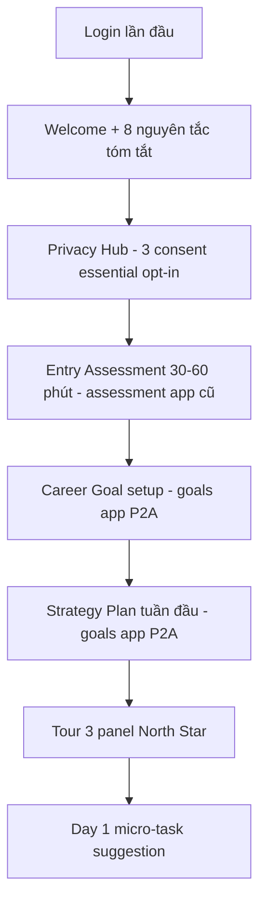
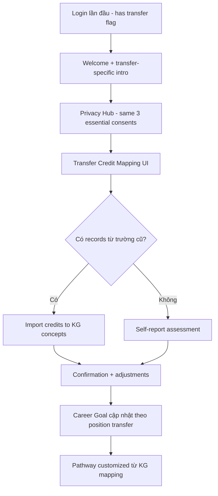
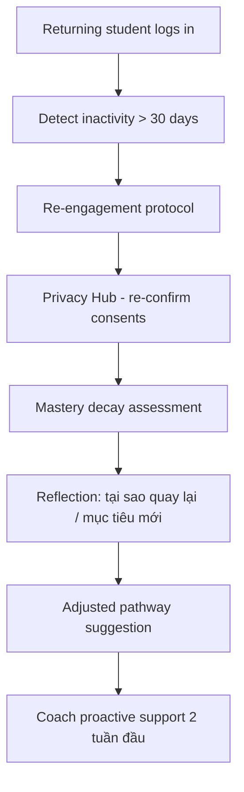

# Cold Start Playbook

> Hướng dẫn xử lý 3 scenario "cold start" của student — không có hoặc có ít history. Đây là edge case mà adaptive learning system thường fail nhất.

## 1. Tại sao cần playbook

Hệ thống adaptive (BKT/DKT/RiskScore/Pathway) đều cần học data để hoạt động tốt. Sinh viên mới vào không có data → system "đoán mò" hoặc "treo". Cold start gây 2 hệ quả:

1. **First impression tệ** — sv mới thấy hệ thống generic, không cá nhân hoá. Adoption rate thấp.
2. **Adaptive engine sai** — BKT khởi tạo `P_L0=0.3` cho tất cả → phân loại sai trong tuần đầu, có thể đẩy sv vào lộ trình quá khó/dễ.

3 scenario cần playbook riêng:
- **A. New student**: hoàn toàn mới, chưa có history nào
- **B. Transfer student**: có học từ trường/khoá khác, có credit/grade
- **C. Returning after dropout**: từng học PALP, nghỉ ≥ 30 ngày, quay lại

## 2. Scenario A — New student

### 2.1 Onboarding flow (5-15 phút)

Tuần 0 — first login:



3 consent essential (default off, prompt rõ ràng):
- `behavioral_signals` (cho RiskScore + adaptive)
- `cognitive_calibration` (cho metacognitive feedback)
- `ai_coach_local` (default on actually, double-check)

### 2.2 Cold-start initialization

| State | Khởi tạo | Source |
|---|---|---|
| `MasteryState.p_mastery` | Từ entry assessment score (per concept) | `assessment.services._seed_mastery_from_assessment` (existing) |
| `MasteryState.p_guess`, `p_slip`, `p_transit` | `PALP_BKT_DEFAULTS` (P_L0=0.3, P_TRANSIT=0.09, etc.) | `backend/palp/settings/base.py` |
| `RiskScore` | Initial composite từ peer cohort prior + entry assessment | `risk.scoring.cold_start_estimate(student)` |
| `StudentPathway.current_concept` | `assessment.services.recommended_start_concept` | existing |
| `WeeklyGoal` | Suggested 5 goals từ strategy plan | `goals.services.suggest_initial_weekly_goals` |
| `PeerCohort` assignment | Tạm thời chưa assign — đợi 4 tuần data trước khi cluster | (P3 logic) |
| `affect_*` consents | Default off, prompt tuần 4 | (defer) |
| `peer_comparison`, `peer_teaching` | Default off (frontier-mode) | (defer) |

### 2.3 First 4 weeks — accelerated learning

Tuần 1-2:
- BKT v2 chạy với prior từ entry assessment (P_L0 = entry_score / max_score)
- RiskScore: composite chỉ academic dimension (chưa đủ behavioral data)
- North Star UI hiển thị "Tuần đầu — coach đang học cách hỗ trợ bạn"
- Coach trigger: daily check-in + weekly reflection prompt
- Lecturer dashboard hiển thị badge "New" cho sv tuần 1-2 (ngữ cảnh khi review alerts)

Tuần 3-4:
- BKT v2 đủ data per concept (5+ attempts) → reliable mastery estimate
- RiskScore composite full 5-dim activate
- Cohort assignment (P3) re-cluster includes new students
- Prompt opt-in `peer_comparison` nếu sv hoàn thành ≥ 50% weekly goals 3 tuần liên tiếp

### 2.4 Key UI copy (Vietnamese)

```
Onboarding welcome screen:
"Chào mừng đến PALP. Hệ thống cá nhân hoá việc học dựa trên cách bạn học.
Tuần đầu, chúng tôi cần biết bạn đang ở đâu — hãy làm bài đánh giá đầu vào (~45 phút).
Đừng lo nếu khó — đây không phải kiểm tra, mà là để hệ thống hiểu bạn."

Sau entry assessment:
"Cảm ơn bạn. Hệ thống đã hiểu sơ bộ năng lực của bạn ở [N] concept.
Bây giờ hãy đặt mục tiêu nghề nghiệp dài hạn (6-12 tháng) — không cần chi tiết, chỉ cần hướng đi."
```

### 2.5 Risk in cold start

| Risk | Mitigation |
|---|---|
| Sv abandon do onboarding quá dài | Split entry assessment thành 3 phiên 15 phút, save progress |
| Initial pathway sai (do entry assessment chỉ đo 1 thời điểm) | Re-evaluate pathway sau 1 tuần data; lecturer có thể manual adjust |
| Sv overwhelm với UI mới | Progressive disclosure — chỉ show core flow, tutorial trong-page contextual |

## 3. Scenario B — Transfer student

### 3.1 Onboarding flow (10-20 phút)



### 3.2 Transfer Credit Mapping

UI mới [`frontend/src/app/(student)/onboarding/transfer/page.tsx`](../frontend/src/app/(student)/onboarding/transfer/page.tsx):

- Lecturer/admin pre-populate KG concept mapping từ original course (nếu có MOU với trường gốc)
- Hoặc sv self-report: "Tôi đã học course X tại trường Y, grade Z, năm 2024" → map fuzzy tới PALP KG concepts
- Mỗi concept transfer: confirm bằng quick verification quiz (3-5 question/concept)
- Verified concepts: `MasteryState.p_mastery` set cao (~0.75) + flag `from_transfer=True`

### 3.3 Cold-start initialization (transfer-specific)

| State | Khác với new student |
|---|---|
| `MasteryState.p_mastery` | Verified concepts từ transfer: 0.65-0.85 range. Unverified concepts: P_L0 default |
| `StudentPathway.current_concept` | Skip verified concepts, start ở first non-verified |
| `RiskScore` | Lower initial risk (đã có học vấn). Closer monitoring tuần 1-2 vì ngữ cảnh thay đổi |
| `PeerCohort` | Có thể tạm assign vào cohort matching năng lực ngay (skip 4-week wait) |
| `transfer_metadata` | New field `accounts.User.transfer_metadata` lưu original_course, year, verification_method |

### 3.4 Lecturer awareness

Lecturer dashboard hiển thị transfer student với:
- Badge "Transfer"
- Verified concepts list (lecturer có thể adjust nếu đánh giá khác)
- Original GPA (if provided, with consent)
- Suggested onboarding 1-on-1 meeting cho lecturer chính

## 4. Scenario C — Returning after dropout

### 4.1 Detection

`accounts.User.last_active_at` > 30 days → flag returning. Trigger sau khi sv login lại.



### 4.2 Mastery Decay

Áp dụng forgetting curve giả định:
- Concepts không revisit > 30 days: `p_mastery_decayed = p_mastery * exp(-days/half_life)` với `half_life = 90 days`
- Lưu vào `p_mastery_pre_decay` (audit) + update `p_mastery`
- Re-assessment optional: 5-question quiz per "decayed concept" để verify

`backend/adaptive/decay.py`:

```python
def apply_mastery_decay(student, days_inactive: int) -> dict:
    """Apply exponential forgetting curve to mastery states.
    
    Grounded in: Ebbinghaus forgetting curve (1885) + 
    Murre & Dros (2015) "Replication and Analysis of Ebbinghaus' Forgetting Curve".
    """
    half_life_days = 90
    decay_factor = math.exp(-days_inactive / half_life_days)
    # ... per-concept decay
```

### 4.3 Re-engagement protocol

Tuần 1 quay lại:
- Coach proactive nudge: "Mừng bạn quay lại. Tuần đầu này coach sẽ nhẹ nhàng hơn — không stress về mastery, chỉ ổn định lại nhịp."
- Risk score reset baseline (don't carry forward old risk for 14 days)
- Goal setting: "Tại sao bạn nghỉ? Lần này muốn khác gì?" — reflection-driven
- Lecturer notify (with sv consent): "Sv X quay lại sau N ngày, có thể cần support extra"

Tuần 2:
- Resume normal adaptive flow nhưng với gentler difficulty curve (P5 ZPD scaffolding)
- Closer monitor RiskScore — early warning threshold lower 20%
- Suggest opt-in reciprocal teaching ngay (peer connection accelerate re-engagement)

### 4.4 Lecturer view

`/(lecturer)/dashboard/` thêm filter "Returning" + badge.
Suggested action: 1-on-1 meeting tuần 1, weekly check-in tuần 2-4.

## 5. Implementation checklist

| Item | App / File | Phase |
|---|---|---|
| Onboarding welcome + tutorial | `frontend/src/app/(student)/onboarding/` | P2 |
| Entry assessment (existing) | `backend/assessment/` | (existing) |
| Initial RiskScore cold-start estimator | `backend/risk/scoring.py::cold_start_estimate` | P1 |
| Suggested initial weekly goals | `backend/goals/services.py::suggest_initial_weekly_goals` | P2 |
| Transfer credit mapping UI | `frontend/src/app/(student)/onboarding/transfer/page.tsx` | P2/P3 |
| Transfer credit verification quiz | `backend/assessment/services.py::transfer_verification_quiz` | P2/P3 |
| Mastery decay function | `backend/adaptive/decay.py` | P5 |
| Re-engagement protocol | `backend/coach/services.py::reengagement_protocol` | P4 |
| Lecturer view filters | `frontend/src/app/(lecturer)/dashboard/` | P1/P2 |

## 6. Metrics to track

Cold start success metrics — track trong P0 MLflow:

| Metric | Target | Measurement |
|---|---|---|
| Onboarding completion rate (new) | ≥ 80% | new users completed entry assessment in 7 days |
| Onboarding completion rate (transfer) | ≥ 70% | (different denominator, more complex) |
| Week-1 retention (new) | ≥ 60% | new users active in week 1 |
| Week-4 retention (new) | ≥ 40% | active in week 4 |
| Returning re-engagement | ≥ 50% | returning users active 2+ weeks after return |
| Cold-start RiskScore accuracy | within ±15% of stable estimate | compare cold-start vs week-4 estimate |

## 7. Edge cases

| Edge case | Handling |
|---|---|
| Sv quay lại sau 6+ tháng | Treat như Scenario C nhưng với deeper re-assessment (full entry assessment optional) |
| Transfer sv nhưng không có records | Treat hybrid: Scenario A onboarding + Scenario B awareness flag |
| Sv có entry assessment incomplete | Show "Nếu đánh giá chưa đầy đủ, lộ trình có thể không tối ưu — hoàn thành sau khi có thời gian" |
| Multiple cold starts (sv quay lại lần thứ 3+) | Lecturer alert + Coach deeper reflection: "Đây là lần thứ N bạn quay lại. Có pattern gì coach giúp được?" |

## 8. Living document

Update playbook khi:
- Pilot data show new edge case
- Onboarding completion rate < target → review UX
- Mastery decay parameter cần tune (P5 data validation)
- New onboarding feature added (e.g., career planning intro)
