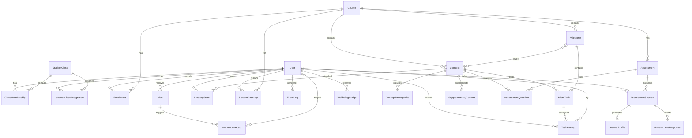

# PALP - Data Model & Event Taxonomy

## Entity Relationship Diagram

## Core Tables

### accounts.User
| Column | Type | Description |
|--------|------|-------------|
| id | BigAutoField | PK |
| username | CharField(150) | Login username |
| email | EmailField | Email |
| role | CharField(10) | student / lecturer / admin |
| student_id | CharField(20) | University student ID |
| consent_given | BooleanField | Privacy consent |
| consent_given_at | DateTimeField | Consent timestamp |

### curriculum.Course
| Column | Type | Description |
|--------|------|-------------|
| id | BigAutoField | PK |
| code | CharField(20) | Course code (e.g., SBVL) |
| name | CharField(200) | Course name |
| credits | SmallIntegerField | Credit count |

### curriculum.Concept
| Column | Type | Description |
|--------|------|-------------|
| id | BigAutoField | PK |
| course_id | FK -> Course | |
| code | CharField(30) | Concept code (e.g., C01) |
| name | CharField(200) | Concept name |
| order | PositiveIntegerField | Sequence in knowledge graph |

### curriculum.Milestone
| Column | Type | Description |
|--------|------|-------------|
| id | BigAutoField | PK |
| course_id | FK -> Course | |
| title | CharField(200) | Milestone title |
| order | PositiveIntegerField | Sequence |
| target_week | SmallIntegerField | Target completion week |
| concepts | M2M -> Concept | Related concepts |

### curriculum.MicroTask
| Column | Type | Description |
|--------|------|-------------|
| id | BigAutoField | PK |
| milestone_id | FK -> Milestone | |
| concept_id | FK -> Concept | |
| title | CharField(200) | Task title |
| task_type | CharField(20) | quiz / short_answer / calculation / drag_drop / scenario |
| difficulty | IntegerField | 1=Easy, 2=Medium, 3=Hard |
| estimated_minutes | SmallIntegerField | Estimated completion time |
| content | JSONField | Task content (question, options, correct_answer) |
| max_score | IntegerField | Maximum score |

### assessment.LearnerProfile
| Column | Type | Description |
|--------|------|-------------|
| id | BigAutoField | PK |
| student_id | FK -> User | |
| course_id | FK -> Course | |
| overall_score | FloatField | Assessment score percentage |
| initial_mastery | JSONField | Per-concept mastery from assessment |
| strengths | JSONField | List of strong concept IDs |
| weaknesses | JSONField | List of weak concept IDs |
| recommended_start_concept | FK -> Concept | Starting point |

### adaptive.MasteryState
| Column | Type | Description |
|--------|------|-------------|
| id | BigAutoField | PK |
| student_id | FK -> User | |
| concept_id | FK -> Concept | |
| p_mastery | FloatField | Current P(mastery) via BKT |
| p_guess | FloatField | P(guess) parameter |
| p_slip | FloatField | P(slip) parameter |
| p_transit | FloatField | P(transit) parameter |
| attempt_count | IntegerField | Total attempts |
| correct_count | IntegerField | Correct attempts |
| version | PositiveIntegerField | Incremented on every BKT recalculation |

### adaptive.TaskAttempt
| Column | Type | Description |
|--------|------|-------------|
| id | BigAutoField | PK |
| student_id | FK -> User | |
| task_id | FK -> MicroTask | |
| score | FloatField | Achieved score |
| is_correct | BooleanField | Correct flag |
| duration_seconds | IntegerField | Time taken |
| hints_used | SmallIntegerField | Number of hints used |
| attempt_number | SmallIntegerField | Which attempt (1st, 2nd, etc.) |

### dashboard.Alert
| Column | Type | Description |
|--------|------|-------------|
| id | BigAutoField | PK |
| student_id | FK -> User | |
| severity | CharField(10) | green / yellow / red |
| status | CharField(15) | active / dismissed / resolved |
| trigger_type | CharField(20) | inactivity / retry_failure / milestone_lag / low_mastery |
| reason | TextField | Human-readable explanation |
| evidence | JSONField | Data supporting the alert |
| suggested_action | TextField | Recommended action for lecturer |

### dashboard.InterventionAction
| Column | Type | Description |
|--------|------|-------------|
| id | BigAutoField | PK |
| alert_id | FK -> Alert | |
| lecturer_id | FK -> User | |
| action_type | CharField(20) | send_message / suggest_task / schedule_meeting |
| targets | M2M -> User | Target students |
| message | TextField | Action message |
| follow_up_status | CharField(20) | pending / student_responded / resolved / no_response |

## Event Taxonomy

| Event Name | Trigger | Key Properties | Used For |
|-----------|---------|----------------|----------|
| session_started | User opens system | user_id, timestamp, device | Active learning time |
| session_ended | User leaves | user_id, duration | Session duration |
| assessment_completed | Submit assessment | score, learning_profile, time_taken | Baseline |
| micro_task_completed | Complete task | task_id, attempts, hints, duration | Completion, mastery |
| content_intervention | System inserts content | concept_id, type, source_rule | Intervention effectiveness |
| gv_action_taken | Lecturer acts | action_type, targets, context | Adoption, effectiveness |
| wellbeing_nudge_shown | >50 min continuous | nudge_type, accepted | Wellbeing engagement |
| page_view | Navigate | page, referrer | Usage analytics |

## Database Constraints

### Unique Constraints

| Table | Constraint Name | Fields | Condition |
|-------|----------------|--------|-----------|
| palp_class_membership | uq_membership_student_class | student, student_class | |
| palp_lecturer_class_assignment | uq_lecturer_class | lecturer, student_class | |
| palp_assessment_session | uq_one_active_session_per_student_assessment | student, assessment | status = 'in_progress' |
| palp_assessment_response | uq_response_session_question | session, question | |
| palp_learner_profile | uq_learner_profile_student_course | student, course | |
| palp_mastery_state | uq_mastery_student_concept | student, concept | |
| palp_student_pathway | uq_pathway_student_course | student, course | |
| palp_enrollment | uq_enrollment_student_course_semester | student, course, semester | |
| palp_concept | uq_concept_course_code | course, code | |
| palp_concept_prerequisite | uq_prereq_concept_prerequisite | concept, prerequisite | |
| palp_alert | uq_alert_dedupe_active | student, trigger_type, concept | status = 'active' |

### Check Constraints

| Table | Constraint Name | Rule |
|-------|----------------|------|
| palp_concept_prerequisite | ck_prereq_no_self_loop | concept != prerequisite |

### Core Indexes

| Table | Index Name | Fields |
|-------|-----------|--------|
| palp_alert | idx_alert_student_status_sev | student, status, severity |
| palp_alert | idx_alert_class_status_created | student_class, status, -created_at |
| palp_assessment_session | idx_session_student_assess_st | student, assessment, status |
| palp_task_attempt | idx_attempt_student_task | student, task, -created_at |
| palp_task_attempt | idx_attempt_student_recent | student, -created_at |
| palp_mastery_state | idx_mastery_student_updated | student, -last_updated |
| palp_wellbeing_nudge | idx_nudge_student_created | student, -created_at |
| palp_event_log | (4 composite indexes) | See events/models.py |

## Soft Delete Policy

| Model | Strategy | Manager |
|-------|----------|---------|
| User | `is_deleted` + `deleted_at` fields | `User.objects` = ActiveUserManager (filters soft-deleted); `User.all_objects` = default Manager |
| EventLog | Append-only, retention enforced by cron (6 months) | N/A |
| AuditLog | Append-only, never deleted | N/A |
| ConsentRecord | Append-only, legal record | N/A |
| All other models | CASCADE from User; no soft delete | N/A |

## Data Privacy Tiers

| Data Group | Sensitivity | Retention | Handling |
|-----------|-------------|-----------|----------|
| PII (name, student_id) | High | Per university policy | AES-256 encrypted |
| Academic history | High | 3 years | Pseudonymized for analytics |
| Learning behavior | Low | 12 months rolling | Minimum collection |
| Event logs | Low | 6 months then aggregate | Debugging & KPI |
