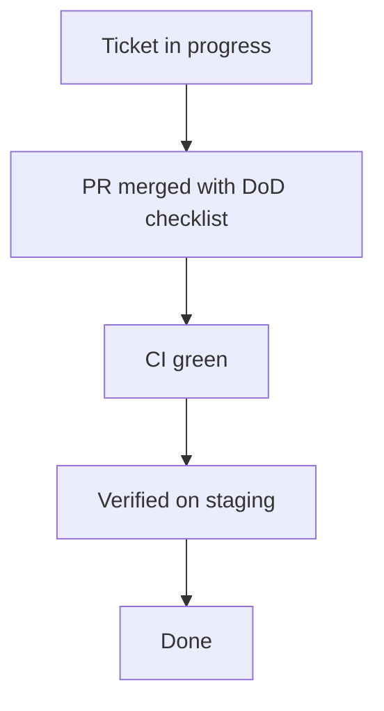

# PALP — Definition of Done (DoD) per ticket

> **Classification**: Internal — Dev / QA / PO / Tech Lead  
> **Scope**: Mọi ticket PALP (story, bug, task) trước khi chuyển sang **Done**  
> **Effective**: Áp dụng từ khi tài liệu này được merge; bổ sung cho [QA_STANDARD.md](QA_STANDARD.md) (release-level)  
> **Owner**: Tech Lead — PO + QA đồng ý nội dung checklist

---

## 1. Mục đích

**Done** không chỉ là “code đã merge”. Một ticket chỉ **Done** khi đồng thời thỏa **12 tiêu chí** dưới đây (hoặc **N/A có lý do** theo ma trận loại ticket — xem Section 4).

DoD ở cấp **ticket** bổ sung cho:

- **Release / Go-No-Go** trong [QA_STANDARD.md](QA_STANDARD.md) (Section 12–13): tổng thể pilot, drill, UAT, sign-off R-01…R-20.
- **CI** ([.github/workflows/ci.yml](../.github/workflows/ci.yml)): tự động lint, test, E2E — DoD vẫn yêu cầu **review người**, **analytics/audit**, **copy/UI**, **a11y**, **sign-off**.

---

## 2. Checklist 12 tiêu chí (bắt buộc đồng thời)

| # | Tiêu chí | Định nghĩa “pass” | Bằng chứng tối thiểu |
|---|----------|-------------------|----------------------|
| **D1** | Code review xong | Ít nhất **1** approval từ reviewer được chỉ định; mọi comment bắt buộc đã resolve hoặc được tracker follow-up có ID | Trạng thái PR Approved + link comment resolve / backlog |
| **D2** | Unit test pass | Test unit cho logic mới/thay đổi; **CI unit** xanh (backend + frontend theo phạm vi thay đổi) | Link job CI + tên file test chính |
| **D3** | Integration test pass | Luồng qua **DB/service/API** liên quan pass; marker `integration` (backend) hoặc integration tương đương | CI integration green hoặc log chạy local đính kèm ticket |
| **D4** | Negative test pass | Có kiểm thử **không chỉ happy path**: 401/403/404/400, validation, RBAC sai, boundary | Test assert `status_code` lỗi hoặc case “invalid/unauthorized/forbidden” trong PR |
| **D5** | Analytics event đã gắn | Mọi hành động có ý nghĩa đo lường fire đúng **event taxonomy** ([DATA_MODEL.md](DATA_MODEL.md) / `events/`) | Tên event + test hoặc log xác nhận persist |
| **D6** | Audit log đã gắn nếu cần | Endpoint truy cập PII / nhạy cảm: đã có **audit** theo `AUDIT_SENSITIVE_PREFIXES` hoặc xác nhận **N/A** (không chạm PII) | Link prefix config + test/log; hoặc ghi rõ N/A |
| **D7** | Copy / UI state đầy đủ | UI: đủ **empty, loading, error, success** (hoặc subset hợp lý được ghi trong AC) | Screenshot staging hoặc E2E cover state |
| **D8** | Accessibility cơ bản pass | **Keyboard**, **focus**, **label** cho control chính; không phụ thuộc hoàn toàn vào màu; heading hợp lý | Ghi chú checklist a11y ngắn hoặc báo cáo axe (nếu có) |
| **D9** | Monitoring hook có sẵn | Lỗi không nuốt im lặng: log có `request_id` (backend); frontend có boundary/error reporting phù hợp; production có Sentry nếu team dùng | Trích log mẫu hoặc chỗ `captureException` / handler |
| **D10** | Docs cập nhật | Mọi thay đổi **hợp đồng** (API, schema, flow bảo mật) cập nhật [API.md](API.md) / [ARCHITECTURE.md](ARCHITECTURE.md) / [DATA_MODEL.md](DATA_MODEL.md) tương ứng | Link diff docs trong PR |
| **D11** | Product Owner sign-off | PO xác nhận **AC** trên ticket đã đạt trên **staging** | Comment PO + ngày hoặc label workflow |
| **D12** | QA sign-off | QA xác nhận đã kiểm theo phạm vi ticket (regression nhỏ nếu cần) | Comment QA + ngày hoặc label |

---

## 3. Ánh xạ DoD → 6 Quality Layers (QA_STANDARD)

| Layer | Tiêu chí DoD liên quan trực tiếp |
|-------|----------------------------------|
| L1 | D1, D2, D3, D4, D7 |
| L2 | D2, D3, D4 (logic học tập / BKT / EW — test theo module trong QA_STANDARD) |
| L3 | D3, D4 (toàn vẹn dữ liệu, lỗi validation) |
| L4 | D4 (RBAC), D6, D10 (privacy/API) |
| L5 | D9, CI + deploy an toàn |
| L6 | D5, D10 (taxonomy, KPI) |

---

## 4. Ma trận N/A theo loại ticket

Không phải ticket nào cũng cần đủ 12 dòng. Quy tắc:

- Ghi **`N/A — lý do ngắn`** trên ticket hoặc trong PR (ví dụ: “D5 N/A: chỉnh typo README”).
- **D11/D12**: luôn cần cho ticket **user-facing** hoặc **ảnh hưởng pilot**. Có thể N/A cho thuần **chore nội bộ** nếu PO/QA policy cho phép — phải ghi rõ.

| Loại ticket | Thường N/A | Ghi chú |
|-------------|------------|---------|
| Backend-only API | D7, D8 | Trừ khi thay đổi ảnh hưởng payload hiển thị |
| Frontend-only copy | D3 | Có thể cần E2E nhỏ thay vì integration backend |
| Infra / CI / tooling | D5, D6, D11, D12 | Theo policy team; vẫn cần D1–D2 phù hợp |
| Bugfix P0/P1 | Giữ đủ D2–D4; D5/D6 nếu touch tracking/audit | Ưu tiên regression test |

---

## 5. Exemption (miễn trừ có kiểm soát)

- Chỉ **PO** (hoặc người được ủy quyền bằng văn bản) có thể **waive** một tiêu chí DoD.
- **Không** waive các tiêu chí liên quan **an toàn / PII / RBAC** (D4, D6) trừ khi Tech Lead + PO đồng ký từng trường hợp.
- Mọi waive phải có: **lý do**, **rủi ro**, **follow-up** (ticket ID) và **thời hạn** nếu có.

---

## 6. Quan hệ với Release checklist (R-01 … R-20)

- **DoD per ticket**: cổng chất lượng **trước/sau merge** cho từng work item.
- **Release (Section 12 QA_STANDARD)**: cổng **toàn bộ** phiên bản (coverage drill, UAT, backup, v.v.).

Quy ước: **Mọi ticket trong một release candidate phải đã Done (DoD)** *trước khi* gom vào nhánh release và chạy đủ R-01…R-20 / Go-No-Go (Section 13).

---

## 7. Automation & PR template

- PR mặc định dùng checklist tại [.github/PULL_REQUEST_TEMPLATE.md](../.github/PULL_REQUEST_TEMPLATE.md).
- Job CI **`dod-hints`** gợi ý (cảnh báo, không chặn merge): docs lệch API, thiếu “negative” test có thể nhận biết — xem [scripts/pr_dod_hints.py](../scripts/pr_dod_hints.py).

---

## 8. Document control

| Version | Date | Notes |
|---------|------|--------|
| 1.0 | 2026-04-16 | Bản đầu — 12 tiêu chí operational |
