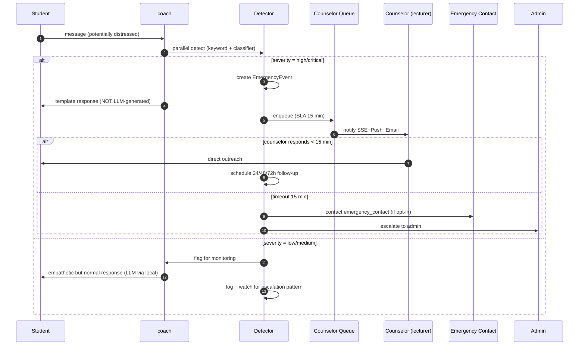

# Emergency Response Pipeline & Training

> **MANDATORY reading cho mọi lecturer được flag `counselor_certified` + admin + dev làm việc trên `backend/emergency/`.** Đây là pipeline xử lý mental health crisis của sinh viên — rủi ro nhân mạng, không chỉ pháp lý.

## 1. Tại sao quan trọng

Sinh viên năm nhất / mất định hướng / áp lực học tập có nguy cơ:
- Mental health crisis (depression, anxiety severe)
- Self-harm ideation
- Suicidal ideation

Trong môi trường đại học VN hiện tại, infrastructure tâm lý/counselor còn yếu, ngại nói. Coach AI có thể phát hiện sớm hơn người, nhưng nếu **xử lý sai** thì làm tệ hơn:
- AI nói "tôi hiểu" rỗng → sinh viên thấy không ai thật sự lắng nghe
- AI tự đưa lời khuyên y tế → có thể harmful
- AI không escalate → bỏ lỡ window cứu người

Pipeline này design theo nguyên tắc: **AI detect, human decide**.

## 2. Pipeline overview



## 3. Detection — `backend/emergency/detector.py`

### 3.1 Layer 1 — Keyword detection

Vietnamese + English self-harm vocabulary list (curated by mental health professional, not by dev). Examples (sample, not exhaustive):

```python
# Storage in DB, not code, để counselor có thể update
class EmergencyKeyword(models.Model):
    keyword = models.CharField(max_length=100)
    language = models.CharField(max_length=5)  # vi, en
    category = models.CharField(max_length=30)  # suicidal, self_harm, severe_distress
    severity_weight = models.FloatField()
    active = models.BooleanField(default=True)
```

### 3.2 Layer 2 — Zero-shot classifier (local LLM)

```python
# backend/emergency/detector.py
async def classify_severity(message: str) -> dict:
    """Use local LLM zero-shot classification."""
    prompt = f"""Đánh giá mức độ nghiêm trọng tâm lý của tin nhắn sau.
    Thang điểm: low / medium / high / critical.
    
    - low: than thở học tập bình thường
    - medium: stress kéo dài, mất hứng thú
    - high: tuyệt vọng, thấy vô nghĩa, không muốn tiếp tục
    - critical: ý định tự làm hại, ý định tự tử
    
    Tin nhắn: "{message}"
    
    Trả lời 1 từ: low | medium | high | critical
    """
    
    result = await local_llm.classify(prompt, labels=["low", "medium", "high", "critical"])
    return {
        "severity": result["label"],
        "confidence": result["score"],
    }
```

### 3.3 Composite decision

```python
def detect_emergency(message: str, user) -> EmergencyDetection:
    keyword_hits = scan_keywords(message)
    classifier_result = classify_severity(message)
    
    severity = combine_signals(keyword_hits, classifier_result)
    
    if severity in ("high", "critical"):
        return EmergencyDetection(
            severity=severity,
            should_escalate=True,
            evidence={
                "keyword_hits": keyword_hits,
                "classifier": classifier_result,
            },
        )
    
    return EmergencyDetection(severity=severity, should_escalate=False)
```

### 3.4 False positive handling

Không-tránh-được false positive. Plan:
- **Severity high (not critical)**: counselor reaches out, judges in person; if false positive, log + tune classifier
- **Severity critical**: alway better safe than sorry; even false alarm, brief outreach OK; sv may appreciate
- Do NOT use false positive count to disable detection — error on side of caution

## 4. Triage & Counselor Queue

### 4.1 Counselor certification

Lecturer phải:
- Hoàn thành training course (xem section 6)
- Pass certification quiz
- Được flag `accounts.User.counselor_certified=True` bởi admin
- Re-certification annually

Min target: 1 counselor per 200 students. Mass class (500+ sv) cần ≥ 3 counselors.

### 4.2 Queue routing

```python
# backend/emergency/queue.py
def assign_counselor(incident: EmergencyEvent) -> User:
    """Assign best-available counselor."""
    candidates = User.objects.filter(
        counselor_certified=True,
        is_active=True,
    ).annotate(
        active_incidents=Count("counselor_assignments", filter=Q(...)),
    ).order_by("active_incidents")  # round-robin by load
    
    # Prefer lecturer of student's class if available
    student_lecturers = get_student_lecturers(incident.student)
    for c in candidates:
        if c in student_lecturers:
            return c
    
    return candidates.first()
```

### 4.3 SLA 15 minutes

```python
# backend/emergency/tasks.py
@shared_task
def check_counselor_sla():
    """Run every minute. Check unresponded incidents."""
    cutoff = timezone.now() - timedelta(minutes=15)
    overdue = EmergencyEvent.objects.filter(
        status="awaiting_counselor",
        created_at__lt=cutoff,
    )
    for incident in overdue:
        escalate_to_emergency_contact(incident)
```

### 4.4 Notification channels

When counselor assigned:
- **In-app SSE**: red banner, browser notification (if permitted)
- **Web Push**: PWA notification with sound (mandatory enable for counselors)
- **Email**: with subject "[URGENT] PALP Emergency Response Needed"
- **SMS** (optional): Twilio fallback if available

All 4 in parallel.

## 5. Counselor playbook — what to do

### 5.1 Immediate (within 15 min)

1. **Read incident detail** in lecturer dashboard `/(lecturer)/emergency/[id]/`
   - Severity + evidence (keyword hits + classifier confidence)
   - Recent CoachTurn excerpts (encrypted, decryptable for counselor with audit)
   - RiskScore history
   - Recent activity pattern
2. **Reach out** to student
   - Channel: direct message in PALP app first (low-friction)
   - If no response in 5 min: phone call (if opt-in) or escalate
3. **Document** assessment in incident:
   - Initial assessment severity (counselor's judgment may differ from AI)
   - Action taken
   - Student response

### 5.2 During conversation

Use evidence-based crisis intervention principles. Training resource: [VIETNAM Hotline 1800-0011](http://www.cuocsong360.vn/) materials adapted.

**Do:**
- Listen actively, no judgment
- Acknowledge emotion without minimizing ("Đây là điều thực sự khó")
- Ask directly about safety ("Bạn có ý định làm hại bản thân không?") — research shows direct asking does NOT increase risk
- Provide concrete next steps (not "everything will be OK")
- Connect to professional help if severe

**Don't:**
- Promise confidentiality you can't keep ("Mình sẽ không nói ai" — no, you may need to escalate)
- Give medical advice ("Bạn nên uống thuốc X")
- Lecture about consequences ("Nghĩ về gia đình")
- Disconnect abruptly

### 5.3 Resolution + follow-up

Mark incident as one of:
- `counselor_intervention`: Counselor handled, follow-up scheduled
- `professional_referral`: Referred to school psychologist / external clinic
- `hospital_emergency`: Emergency 115, transported
- `false_positive`: AI was wrong, brief check confirmed sv OK
- `unresolved_unable_contact`: Could not reach sv → escalate emergency_contact

Schedule follow-up:
- 24h: brief check-in via app/phone
- 48h: status update, adjust plan
- 72h: closure or re-escalate

## 6. Counselor training course

### 6.1 Content (8 hours)

| Module | Duration | Topic |
|---|---|---|
| 1 | 1h | Mental health 101 — depression, anxiety, suicidal ideation prevalence in VN students |
| 2 | 1h | PALP detection system overview — what AI sees, what it can't |
| 3 | 2h | Crisis intervention skills (active listening, direct asking, de-escalation) — role-play |
| 4 | 1h | Vietnamese cultural considerations (stigma, family role, religion) |
| 5 | 1h | When to refer — school resources, hotlines, hospitals |
| 6 | 1h | Self-care for counselors (burnout, vicarious trauma) |
| 7 | 1h | PALP system walkthrough — incident dashboard, audit, follow-up tools |

### 6.2 Certification

- 80% pass on multiple-choice quiz
- Pass role-play scenario evaluation by certified trainer
- Re-certification annually

### 6.3 Resources

- VN Hotline: 1800-0011 (free, 24/7)
- Vietnam National Institute of Mental Health: vnimh.gov.vn
- Internal trainer designation per institution

## 7. Emergency Contact opt-in

### 7.1 What it is

Sinh viên pre-register 1-2 trusted person (lecturer/parent/friend) qua [`/preferences/emergency-contact/`](../frontend/src/app/(student)/preferences/emergency-contact/page.tsx). Used ONLY khi:

- Severity = critical
- Counselor không respond trong SLA 15 min, OR
- Counselor judgment quyết định cần outreach trusted person

### 7.2 What it's NOT

- Not used for "just because we worry" — strict trigger
- Not used for academic issues
- Not used without sv knowing (sv informed when activated)

### 7.3 Storage

```python
class EmergencyContact(models.Model):
    student = models.ForeignKey(User, on_delete=models.CASCADE)
    name = EncryptedTextField()  # Fernet
    relationship = models.CharField(max_length=50)
    phone_encrypted = EncryptedTextField()
    email_encrypted = EncryptedTextField(blank=True)
    consent_given_at = models.DateTimeField()
    revoked_at = models.DateTimeField(null=True)
```

Encryption: Fernet, key in `PII_ENCRYPTION_KEY` env. Decrypt only at activation time, audit log.

## 8. Follow-up cycle

### 8.1 24h follow-up

Automated via Celery `emergency.tasks.followup_24h(incident_id)`:

```python
@shared_task
def followup_24h(incident_id):
    incident = EmergencyEvent.objects.get(pk=incident_id)
    
    # Send check-in via in-app
    NotificationService.send(
        student=incident.student,
        channel="in_app",
        template="emergency_followup_24h",
        urgency="high",
    )
    
    # Notify counselor to verify outreach
    notify_counselor(incident.assigned_counselor, "24h follow-up due")
```

Template message:

```
"Chào [STUDENT_NAME]. 24 giờ trước bạn có gặp khó khăn và counselor [COUNSELOR_NAME] đã liên hệ.

Bạn cảm thấy thế nào hôm nay?

[Tốt hơn] [Vẫn vậy] [Tệ hơn]

Nếu cần nói chuyện ngay: [Liên hệ counselor] [Hotline 1800-0011]"
```

### 8.2 48h + 72h

Similar templates, longer interval. Closure or re-escalate decision at 72h.

### 8.3 Long-term monitoring

Sv với incident lịch sử có flag `recent_emergency_history=True` for 6 months. Coach sensitivity raised, RiskScore weighting adjusted, lecturer notified (with sv consent).

## 9. Incident log + audit

### 9.1 IncidentLog model

Existing `privacy.IncidentLog` extended:

```python
class IncidentLog(models.Model):
    # existing fields...
    incident_type = models.CharField()  # add "mental_health_emergency"
    severity = models.CharField()
    counselor_assigned = models.ForeignKey(User, null=True)
    response_time_seconds = models.IntegerField(null=True)
    resolution = models.CharField()
    contacts_used = models.JSONField()  # list of channels used
    follow_up_completed = models.JSONField()  # 24h/48h/72h status
```

### 9.2 Audit trail

Every action logged:
- Detection event (with confidence)
- Counselor assignment
- Counselor response (timestamp, channel)
- Follow-up sent + responded
- Emergency contact activated (if any)
- Resolution

Retention: 7 years (for legal + research). Encrypted. Access requires emergency-flag + audit log of access.

### 9.3 Quarterly review

Counselor team + admin review:
- All incidents in past quarter
- Detection accuracy (false positive/negative rate)
- Counselor response times
- Outcomes
- System improvements needed

Output: action items for next quarter (tune classifier, update training, adjust SLA, etc.)

## 10. Emergency contacts (institution-level)

PALP institution must have:

| Resource | Phone | Hours |
|---|---|---|
| In-house counselor on-call | (internal) | Office hours |
| VN Mental Health Hotline | 1800-0011 | 24/7 free |
| Emergency 115 | 115 | 24/7 |
| Local hospital with psychiatry | (varies) | 24/7 |

Display in [`/(student)/help/emergency/page.tsx`](../frontend/src/app/(student)/help/emergency/page.tsx) always accessible.

## 11. Legal + ethical considerations

### 11.1 Limits of AI detection

Coach AI is NOT:
- A licensed mental health professional
- A replacement for human counselor
- A diagnostic tool

UI must always disclose: "Coach AI có thể phát hiện một số tín hiệu, nhưng không thay thế được tư vấn chuyên môn. Khi cần, hãy liên hệ counselor [name] hoặc hotline 1800-0011."

### 11.2 Confidentiality limits

Counselor must inform sv at first contact:
"Mình giữ kín hầu hết, nhưng nếu mình tin bạn hoặc người khác đang bị nguy hiểm, mình có thể cần thông báo cho [school admin / family]. Đây là quy tắc bảo vệ bạn."

### 11.3 Data handling

- Emergency-related data classified as Special Category PII
- Access strictly RBAC: counselor + admin + sv themselves
- Audit log every access
- Retention 7 years (for safety + research consent)

## 12. Living document + governance

- Quarterly review with mental health professional
- Update keyword list as needed
- Update training course annually
- Annual external review (if institution has DPO/ombudsman)

## 13. Skills + related docs

- [emergency-response skill](../.ruler/skills/emergency-response/SKILL.md) — workflow when modifying emergency code
- [coach-safety skill](../.ruler/skills/coach-safety/SKILL.md) — coach interaction safety
- [COACH_SAFETY_PLAYBOOK.md](COACH_SAFETY_PLAYBOOK.md) — overall coach safety
- [PRIVACY_V2_DPIA.md](PRIVACY_V2_DPIA.md) section 3.9 (emergency_contact consent)
- [INCIDENT_CULTURE.md](INCIDENT_CULTURE.md) — postmortem process
