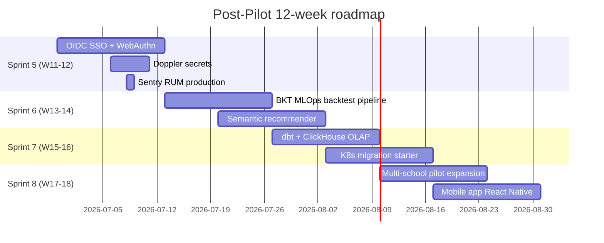

# PALP Post-Pilot Roadmap

Tài liệu này list các tính năng và infrastructure được defer khỏi sprint
1-4 (đã làm trong session) vì cần external service, credential thật, hoặc
quá heavy cho session đầu. Mỗi item có runbook setup chi tiết để team
implement sau pilot.

## Defer Items

### 1. BKT MLOps Full Pipeline

**Tại sao defer**: MLflow self-host cần ~500MB RAM + Postgres backend.
Backtest pipeline cần TaskAttempt 90 ngày data → chưa có data đến tuần W6.

**Implementation guide**:
1. Add MLflow service vào `infra/mlflow/docker-compose.mlflow.yml`:
   ```yaml
   mlflow:
     image: ghcr.io/mlflow/mlflow:v2.16.0
     command: mlflow server --backend-store-uri postgresql://palp:pwd@db:5432/mlflow_db --default-artifact-root s3://palp-mlflow/ --host 0.0.0.0
     ports: ["5000:5000"]
   ```
2. Tạo `backend/adaptive/mlops/` module:
   * `backtest.py` — replay TaskAttempt qua engine với param mới vs cũ.
   * `metrics.py` — Brier score, ECE, log loss.
   * `drift.py` — PSI giữa cohort tuần này vs baseline.
3. Celery beat task `backtest_bkt_weekly` Chủ nhật 04:00 → log MLflow run.
4. Grafana dashboard panel calibration plot từ MLflow API.

**Estimated effort**: 3-5 ngày developer.

### 2. Semantic Content Recommender

**Tại sao defer**: sentence-transformers `paraphrase-multilingual-MiniLM-L12-v2`
~120MB download + cần pgvector extension trong Postgres + retraining
pipeline.

**Implementation guide**:
1. Add pgvector vào Postgres image (`pgvector/pgvector:pg16` thay
   `postgres:16-alpine`).
2. Migration thêm column `embedding vector(384)` cho `SupplementaryContent`
   và `Concept`.
3. Service `backend/curriculum/embeddings.py`:
   * `embed_content(content_id)` — sentence-transformers encode.
   * `find_similar(concept, top_k=5)` — cosine similarity qua pgvector.
4. Replace `_find_supplementary` trong `adaptive/engine.py` với semantic
   ranking, fallback ID-based nếu embedding null.
5. Celery task `reembed_content_nightly` — re-embed content mới thêm.

**Estimated effort**: 5-7 ngày developer + ML engineer.

### 3. dbt + Great Expectations + ClickHouse OLAP

**Tại sao defer**: 3 service mới + dbt project ~30 model + steep learning
curve.

**Implementation guide**:
1. Add ClickHouse compose service (`clickhouse/clickhouse-server:24.8`).
2. PostgreSQL → ClickHouse logical replication qua Materialized View
   trên EventLog.
3. Tạo `analytics_dbt/` project:
   * `staging/` — 1-1 với raw tables.
   * `marts/cohorts/` — weekly retention, milestone funnel.
   * `marts/efficacy/` — pre/post mastery delta.
   * `marts/lecturer/` — get_class_overview pre-aggregation.
4. Great Expectations suite cho EventLog schema, run mỗi giờ Celery.
5. Grafana datasource ClickHouse cho time-series dashboard.

**Estimated effort**: 1-2 tuần developer + data engineer.

### 4. OIDC SSO Microsoft Entra/Google Workspace

**Tại sao defer**: cần real `client_id` + `client_secret` từ DAU IT
team (Azure AD tenant) hoặc Google Workspace admin.

**Implementation guide**:
1. Install `django-allauth>=0.62`.
2. Settings:
   ```python
   INSTALLED_APPS += ["allauth", "allauth.account", "allauth.socialaccount",
                      "allauth.socialaccount.providers.microsoft",
                      "allauth.socialaccount.providers.google"]
   SOCIALACCOUNT_PROVIDERS = {
       "microsoft": {"APP": {"client_id": "...", "secret": "...",
                              "settings": {"tenant": "dau.edu.vn"}}},
   }
   ```
3. Frontend login page thêm button "Đăng nhập bằng tài khoản DAU".
4. Auto-create User local khi SSO success, map email → student_id.
5. Pilot tài khoản local fallback giữ cho admin.

**Estimated effort**: 3-5 ngày + 1 tuần coordinate với DAU IT.

**Pre-requisites cần thu thập**:
* Microsoft 365 tenant ID + admin consent cho redirect URL.
* Google Workspace OAuth client + verified domain.

### 5. WebAuthn / Passkey

**Tại sao defer**: cần HTTPS production environment để test (browser yêu
cầu HTTPS for WebAuthn). Pilot dev local HTTP-only.

**Implementation guide**:
1. Install `django-otp + fido2`.
2. Model `WebAuthnCredential(user, credential_id, public_key, sign_count)`.
3. Endpoint `/api/auth/webauthn/register/`, `/authenticate/`.
4. Frontend dùng `@simplewebauthn/browser`.
5. Mandatory cho `is_staff=True` admin, optional cho lecturer.
6. Backup code one-time (10 mã, hash + show 1 lần).

**Estimated effort**: 5 ngày developer + UX designer.

### 6. HashiCorp Vault / Doppler Secrets

**Tại sao defer**: Vault self-host phức tạp, Doppler có free tier 5 user
nhưng cần signup + project setup.

**Implementation guide cho Doppler (recommended)**:
1. Signup Doppler.com → tạo project `palp` + 3 environment (dev, staging, prod).
2. Add secrets từ `.env` qua Doppler dashboard.
3. Replace `env_file: .env` trong compose với `command: doppler run -- ...`.
4. CI: `doppler secrets download --no-file --format docker > .env` step.
5. Audit log via Doppler dashboard.

**Implementation guide cho Vault (advanced)**:
1. Add Vault service `hashicorp/vault:1.18` compose.
2. Init + unseal (sealed envelope offline).
3. KV v2 secret engine `secret/palp/`.
4. Backend dùng `hvac` library đọc secret runtime hoặc External Secrets
   Operator nếu deploy K8s.

**Estimated effort**: 1-2 ngày Doppler, 5 ngày Vault.

### 7. Sentry RUM (Real User Monitoring) Production

**Tại sao defer**: cần Sentry account + DSN. Scaffold đã có trong
`frontend/src/app/layout.tsx` với env guard.

**Implementation guide**:
1. Signup sentry.io → tạo project type "React" + "Django".
2. Backend env: `SENTRY_DSN=https://...@sentry.io/...`.
3. Frontend env: `NEXT_PUBLIC_SENTRY_DSN=https://...@sentry.io/...`.
4. SDK init trong `_app.tsx` với traces sample 30%, profiles 10%.
5. Source maps upload qua sentry-cli trong CI.

**Estimated effort**: 0.5 ngày.

## Prioritization After Pilot



## Items Not in Roadmap (Out of Scope)

* Custom LLM tutor / chatbot (rủi ro hallucinate cho EdTech).
* Blockchain credential verification (over-engineered cho phase 1).
* VR/AR learning module (không phù hợp Sức Bền Vật Liệu pilot scope).
