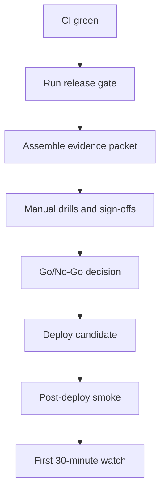

# PALP RC Runbook

> Classification: Internal - Dev / QA / PO / Tech Lead / DevOps / GV representative
> Scope: Release candidates for PALP staging and production promotion
> Purpose: Operational release-control guide on top of `QA_STANDARD.md`
> Owner: Tech Lead with QA Lead, DevOps, and PO sign-off

## 1. Executive Summary
This document is the release command center for PALP release candidates. Use it to move one candidate from CI-green to Go/No-Go, then through deploy verification and the first 30 minutes of watch.

It does not replace the policy documents. It turns them into a live operating procedure with exact workflows, scripts, evidence, owners, and stop conditions.

| Item | RC standard |
|------|-------------|
| Objective | Promote only a release candidate that is functionally correct, pedagogically safe, privacy-safe, observable, and recoverable |
| Primary owner | One named RC owner coordinates the gate, evidence packet, sign-offs, and deploy handoff |
| Required inputs | Target ref/tag, environment, CI run URL, release gate report, UAT report, backup proof, rollback proof, open-risk list |
| Hard blockers | Any `NG-*` fail, any open P0/P1 bug, high/critical security issue, privacy failure, backup/rollback drill failure, post-deploy smoke failure |
| Evidence location | One RC ticket or release issue containing every link, artifact, screenshot, and approval |
| Required approvers | QA Lead, Tech Lead, DevOps, PO, GV representative |

### How To Use This Document
1. Start only when the entry criteria in Section 5 are already true.
2. Treat CI green as a prerequisite, not as release approval.
3. Capture every artifact in one RC ticket or release issue. Do not spread approvals across chat.
4. Use the workflow-based path first so reports are uploaded as artifacts. Use local commands only as fallback or for manual drills.
5. Do not use `--skip-tests` for release evidence. That flag is diagnostic only.
6. If any `NG-*` item fails, stop and classify the candidate as `NO-GO`.
7. If post-deploy smoke fails, treat it as `ROLLBACK NOW`.

## 2. Purpose And Scope
`QA_STANDARD.md` is the normative quality bar for PALP. `TESTING.md`, `ci.yml`, `release_gate.py`, `release_checklist.py`, `smoke_test.sh`, and `release.yml` describe the current automation and operating path.

This runbook is the operational layer between those two worlds. It tells the team:

1. What to run.
2. In what order.
3. What evidence must exist before sign-off.
4. Which checks are automated versus still manual.
5. How to handle mismatches between policy and current CI enforcement.

Primary references:

- [QA_STANDARD.md](QA_STANDARD.md)
- [TESTING.md](TESTING.md)
- [DEFINITION_OF_DONE.md](DEFINITION_OF_DONE.md)
- [UAT_SCRIPT.md](UAT_SCRIPT.md)
- [DEPLOYMENT.md](DEPLOYMENT.md)
- [`../.github/workflows/ci.yml`](../.github/workflows/ci.yml)
- [`../.github/workflows/release.yml`](../.github/workflows/release.yml)
- [`../scripts/release_gate.py`](../scripts/release_gate.py)
- [`../scripts/release_checklist.py`](../scripts/release_checklist.py)
- [`../scripts/smoke_test.sh`](../scripts/smoke_test.sh)

## 3. Release Flow At A Glance



## 4. Release Roles And Control Points
| Role | Must verify | May veto on | Required evidence |
|------|-------------|-------------|-------------------|
| RC owner | Entry criteria, packet completeness, final decision state, handoff between teams | Missing evidence packet or missing approver | RC ticket with all links and decisions |
| QA Lead | Test results, E2E core journeys, regression confidence, open bug status, data QA evidence | Failed core flow, open P0/P1, missing regression proof | CI run URL, `playwright-report`, release gate report, bug status proof |
| Dev Lead | Coverage results, integration health, API contract results, migration risk | Broken build, contract break, unsafe migration, unexplained coverage gap | Coverage artifacts, CI logs, migration review note |
| Tech Lead | Security, privacy, architecture-impacting deviations, source-of-truth decisions | High/critical security issue, privacy gap, policy deviation without documented rationale | Security audit result, privacy proof, deviation notes |
| DevOps | Backup drill, rollback drill, target environment readiness, smoke verification, monitoring readiness | Backup or rollback failure, unhealthy environment, smoke failure | Backup proof, rollback proof, smoke log, monitoring proof |
| PO | UAT result, product readiness, approved exceptions, release communication | UAT failure, unresolved product risk, unsupported exception | UAT report, approved risk/waiver note |
| GV representative | Dashboard usefulness and learning-intervention trust at pilot level | UAT evidence shows low trust or unsafe instructional behavior | UAT comments and approval note |

Operational rule: every role with veto power must either sign off or explicitly mark `NO-GO`. Silence is not approval.

## 5. Entry Criteria Before RC Execution
Do not start the RC gate until every item below is true.

| Entry check | Required state | Evidence |
|-------------|----------------|----------|
| RC ref locked | Branch, commit SHA, or tag is identified and not changing during the gate | RC ticket records ref and SHA |
| CI baseline green | Required CI jobs have passed on the RC ref | CI run URL |
| Migration understood | Forward path, rollback path, and compatibility risk are reviewed | Migration note in RC ticket |
| Environment confirmed | Target environment and `BASE_URL` are known | RC ticket records environment and URL |
| Owners named | RC owner and all approvers are identified before evidence collection starts | Names in RC ticket |
| UAT/reporting inputs ready | Latest UAT report and known open risks are attached | UAT link plus risk list |
| Pre-release checklist started | Pre-release items are being tracked in one place | Output of `python scripts/release_checklist.py --phase pre` pasted into RC ticket |

If any entry item is missing, the candidate is `HOLD` before the gate even begins.

## 6. RC Execution Steps
### 6.1 Confirm CI Baseline
The RC starts only after the baseline CI pipeline is green on the target ref.

Required jobs from [`../.github/workflows/ci.yml`](../.github/workflows/ci.yml):

| Job | What it proves | Evidence |
|-----|----------------|----------|
| `lint` | Backend/frontend lint, Bandit, and typing baseline are green | Job URL |
| `migration-check` | No missing migrations | Job URL |
| `openapi` | OpenAPI diff has no breaking change against baseline | Job URL |
| `security-audit` | `pip-audit` and `npm audit` gate is green | Job URL |
| `backend-test` | Unit, integration, contract, security, data QA, recovery suites are green; backend coverage artifacts uploaded | Job URL + `backend-coverage` + `coverage-xml` |
| `frontend-test` | Frontend tests and coverage job are green | Job URL |
| `e2e` | Core browser journey suite is green | Job URL + `playwright-report` |
| `build` | Images and production compose build succeed | Job URL |

Fail rule: any red baseline job means `HOLD`. Do not start release gate, sign-off, or deploy planning.

### 6.2 Run Release Gate
Preferred path: manually dispatch `PALP CI` with `run_release_gate=true` on the RC ref. This will run the `release-gate` job after `e2e` and `build` and upload both text and JSON reports.

Local fallback:

```bash
python scripts/release_gate.py --format text
python scripts/release_gate.py --format json > release-gate-report.json
```

Supporting checklist commands:

```bash
python scripts/release_checklist.py --phase pre
python scripts/release_checklist.py --phase post
```

Rules for this step:

1. Do not use `--skip-tests` for release evidence.
2. Keep the raw text report and JSON report together.
3. `release_gate.py` is a helper for the automatable subset. It does not replace manual drills, UAT, bug review, or sign-off.

Expected artifacts:

- `release-gate-report.txt`
- `release-gate-report.json`

Fail rule:

- Any `NG-*` fail in the release gate is immediate `NO-GO`.
- Any `G-*` fail is `HOLD` until fixed or formally classified as `NO-GO` in the decision meeting.

### 6.3 Assemble The Automated Evidence Packet
Once CI and release-gate outputs exist, the RC owner builds a single evidence packet in the RC ticket.

Minimum automated evidence:

- CI run URL
- `backend-coverage`
- `coverage-xml`
- `playwright-report`
- `release-gate-report.txt`
- `release-gate-report.json`
- security audit job result
- OpenAPI diff job result

Operational rule: if an automated result exists but is not linked in the RC packet, treat it as missing.

### 6.4 Collect Manual Blocking Evidence
The following items remain blocking even if all automated jobs are green:

| Manual item | Minimum proof |
|-------------|---------------|
| Backup/restore drill | Timestamped drill output plus record-count or checksum verification per `QA_STANDARD.md` Section 9.2 |
| Rollback drill | Timestamped rollback test result per `QA_STANDARD.md` Section 9.3 |
| UAT | Latest report from [UAT_SCRIPT.md](UAT_SCRIPT.md) with exit criteria summary |
| Open bug status | Proof that open P0 = 0 and open P1 = 0 |
| Monitoring readiness | Proof that Sentry, `/api/health/`, Prometheus metrics, and alert rules are live |
| Load/performance evidence | Locust or equivalent report attached for the candidate, or a documented still-valid baseline if policy allows reuse |

Locust command reference from [TESTING.md](TESTING.md):

```bash
cd backend
locust -f tests/load/locustfile.py \
  --host=http://localhost:8000 \
  --users 100 \
  --spawn-rate 10 \
  --run-time 10m \
  --headless \
  --csv=results/load
```

Fail rule:

- Backup drill fail -> `NO-GO`
- Rollback drill fail -> `NO-GO`
- Missing UAT or unresolved P0/P1 -> `NO-GO`
- Missing monitoring or load evidence -> `HOLD` before decision; unresolved at decision time -> `NO-GO`

### 6.5 Complete The Go/No-Go Decision
Use one checklist and one evidence packet. The decision meeting does not start until the packet is complete enough for review.

The meeting must confirm:

1. No `NG-*` condition is violated.
2. Every required `G-*` condition has evidence.
3. Any mismatch between policy and current CI enforcement is visible and named.
4. Any accepted non-blocking deviation has owner, rationale, expiry, and follow-up ticket.

Decision outputs allowed:

- `GO`
- `NO-GO`
- `HOLD`

Operational rule: `HOLD` is allowed before deploy. `HOLD` is not a release approval.

### 6.6 Deploy And Run Post-Deploy Smoke
Deploy the approved candidate using the environment's approved deployment path. Immediately after deploy, run post-deploy smoke using [`../.github/workflows/release.yml`](../.github/workflows/release.yml) or the script directly.

Workflow path:

- Dispatch `PALP Release`
- Inputs:
  - `environment`: `staging` or `production`
  - `base_url`: target environment URL

Local/script path:

```bash
BASE_URL=https://staging.palp.dau.edu.vn bash scripts/smoke_test.sh
BASE_URL=https://palp.dau.edu.vn SMOKE_USER=<user> SMOKE_PASSWORD=<password> CLASS_ID=1 bash scripts/smoke_test.sh
```

What smoke currently checks in [`../scripts/smoke_test.sh`](../scripts/smoke_test.sh):

1. `GET /api/health/` returns `200` and includes `"status"`.
2. Optional login returns `200` when smoke credentials are provided.
3. `GET /api/curriculum/courses/` returns `200` or `401`.
4. `GET /api/dashboard/alerts/?class_id=1` returns `200`, `401`, or `403`.

Fail rule: any non-zero smoke result is `ROLLBACK NOW`.

### 6.7 First 30-Minute Watch
After smoke passes, keep the candidate under active watch for the first 30 minutes.

Recommended command references:

```bash
python scripts/release_checklist.py --phase post
curl https://<base-url>/api/health/
curl https://<base-url>/api/health/ready/
```

Operational checks from [DEPLOYMENT.md](DEPLOYMENT.md):

- Admin checks `GET /api/health/deep/`
- Watch Sentry for new errors
- Confirm Prometheus scrape/metrics visibility
- Confirm Celery worker and beat health
- Confirm queue depth is normal
- Spot-check event ingestion and alert generation

Useful ops commands:

```bash
docker-compose exec celery celery -A palp inspect stats
docker-compose exec redis redis-cli llen celery
docker-compose logs -f backend
docker-compose logs -f celery
```

Fail rule:

- Health endpoint unavailable, cross-class leak, missing core events, or severe instability -> `ROLLBACK NOW`
- Non-fatal anomaly without user impact -> `HOLD` and investigate before declaring the release stable

## 7. Evidence Matrix
Use this matrix to make the RC packet defensible.

| Gate | Automated or manual | Exact run path | Required artifact/proof | Owner | Fail outcome |
|------|---------------------|----------------|-------------------------|-------|--------------|
| CI baseline | Automated | `PALP CI` on RC ref | Workflow URL plus green jobs | RC owner + Dev Lead | `HOLD` |
| Coverage evidence | Automated | `backend-test`, `frontend-test` | `backend-coverage`, `coverage-xml`, frontend coverage log | Dev Lead | `HOLD`, plus deviation note if policy bar is missed |
| E2E core flows | Automated | `e2e` job / `npm run test:e2e` | `playwright-report` | QA Lead | `NO-GO` until fixed |
| Release gate subset | Automated | `release-gate` job or `python scripts/release_gate.py --format text/json` | `release-gate-report.txt`, `release-gate-report.json` | QA Lead | `NG-*` fail = `NO-GO`; `G-*` fail = `HOLD` |
| Security gate | Automated + manual review | `security-audit`, `pytest -m security`, Tech Lead review | Audit job URL plus risk note | Tech Lead | `NO-GO` on high/critical issue |
| Load/performance | Manual or separately automated | Locust run per [TESTING.md](TESTING.md) Section 6 | Locust CSV/report link | QA Lead + DevOps | `HOLD` or `NO-GO` depending on SLO gap |
| Backup/restore | Manual | Drill per [QA_STANDARD.md](QA_STANDARD.md) Section 9.2 | Drill log plus verification proof | DevOps | `NO-GO` |
| Rollback readiness | Manual | Drill per [QA_STANDARD.md](QA_STANDARD.md) Section 9.3 | Drill log plus restoration proof | DevOps | `NO-GO` |
| UAT | Manual | Review [UAT_SCRIPT.md](UAT_SCRIPT.md) evidence | UAT report link and exit criteria summary | PO + QA Lead | `NO-GO` |
| Bug status | Manual | Bug tracker query/export | Proof that open P0 = 0 and open P1 = 0 | QA Lead | `NO-GO` |
| Monitoring readiness | Mixed | `release_gate.py` `G-09` plus manual infra checks | Sentry proof, health proof, Prometheus proof, alert rules proof | DevOps + Tech Lead | `HOLD` or `NO-GO` |
| Post-deploy smoke | Automated/scripted | `PALP Release` or `bash scripts/smoke_test.sh` | Smoke log | DevOps | `ROLLBACK NOW` |

## 8. Release Evidence Packet Template
Paste the block below into the RC ticket and fill every field before the decision meeting.

```md
# PALP RC Evidence Packet

- Version/tag:
- Commit SHA:
- Environment:
- Base URL:
- RC owner:
- Decision meeting time:

## Automated evidence
- [ ] CI run URL:
- [ ] lint:
- [ ] migration-check:
- [ ] openapi:
- [ ] security-audit:
- [ ] backend-test:
- [ ] frontend-test:
- [ ] e2e:
- [ ] build:
- [ ] release-gate-report.txt:
- [ ] release-gate-report.json:
- [ ] backend-coverage artifact:
- [ ] coverage-xml artifact:
- [ ] playwright-report artifact:

## Manual blocking evidence
- [ ] Backup/restore drill proof:
- [ ] Rollback drill proof:
- [ ] Load/performance report:
- [ ] UAT report:
- [ ] Bug status proof (P0=0, P1=0):
- [ ] Sentry readiness proof:
- [ ] Health endpoint proof:
- [ ] Prometheus and alert-rule proof:

## Source-of-truth notes
- Policy bar referenced from:
- Current enforced CI gates referenced from:
- Any mismatch between policy and enforcement:

## Open risks and deviations
- None / list each item with owner, rationale, expiry, and follow-up ticket

## Decision
- [ ] GO
- [ ] HOLD
- [ ] NO-GO

## Post-deploy
- [ ] Smoke log:
- [ ] First 30-minute watch summary:
- [ ] Final status:
```

## 9. Source-Of-Truth Rules
Use the rules below whenever documents or automation do not line up perfectly.

1. `QA_STANDARD.md` is the normative quality bar.
2. [`../.github/workflows/ci.yml`](../.github/workflows/ci.yml), [TESTING.md](TESTING.md), [`../backend/pytest.ini`](../backend/pytest.ini), and [`../frontend/vitest.config.ts`](../frontend/vitest.config.ts) describe the current enforced automation.
3. CI green is necessary but not sufficient for release approval.
4. If the policy bar is higher than the current enforced CI gate, the RC packet must state the mismatch explicitly instead of hiding it.
5. If a check is manual, absence of proof means the check is not passed.
6. `release_gate.py` covers only the automatable subset and cannot replace the full Go/No-Go review.
7. `--skip-tests` is never valid release evidence.

### Current Ambiguities That Must Be Named
| Area | Operational rule in this runbook |
|------|----------------------------------|
| Core backend coverage | Policy docs aim at `>=90%` for core logic, but current CI gates the four core apps at `>=85%` and overall backend at `>=80%`. RC sign-off must record the actual coverage numbers, not just "CI green". |
| Frontend coverage scope | Frontend coverage currently comes from Vitest with thresholds on `src/lib/**` and `src/hooks/**`. Treat it as partial signal, not as full-app proof. |
| Monitoring gate | This runbook uses the stricter release interpretation: release readiness means Sentry, `/api/health/`, Prometheus metrics, and alert rules are live. Current auto-checks alone are not enough. |
| Load/performance evidence | Load testing is not in the default PR gate. RC packets must attach a Locust or equivalent performance report separately. |

Operational rule: when in doubt, escalate to the stricter interpretation and document the gap.

## 10. Decision States And Failure Playbooks
### State Definitions
| State | Meaning |
|-------|---------|
| `HOLD` | The candidate is paused. No deploy or no promotion until the gap is resolved. |
| `NO-GO` | The candidate is rejected for release. A new or repaired candidate is required. |
| `ROLLBACK NOW` | A deployed build must be reversed immediately. |

### Failure Playbooks
| Trigger | State | Required action | Owner |
|---------|-------|-----------------|-------|
| Any `NG-*` fail in release gate | `NO-GO` | Stop the RC, fix root cause, rerun gate, rebuild packet | QA Lead + RC owner |
| Any `G-*` fail before decision meeting | `HOLD` | Fix or document for decision review; do not deploy | RC owner + responsible lead |
| Backup/restore drill fail | `NO-GO` | Repair backup path, rerun drill, attach fresh proof | DevOps |
| Rollback drill fail | `NO-GO` | Repair rollback path before any deploy approval | DevOps |
| Open P0/P1 or unresolved privacy/security blocker | `NO-GO` | Fix issue, retest, and refresh ticket evidence | QA Lead + Tech Lead |
| Smoke test returns non-zero | `ROLLBACK NOW` | Execute rollback path, open incident, attach logs | DevOps |
| Health unavailable, cross-class leak, event ingestion missing, or severe data-risk signal in first 30 minutes | `ROLLBACK NOW` | Roll back first, investigate second | DevOps + Tech Lead |
| Monitoring anomaly without confirmed user impact | `HOLD` | Keep release under active watch, investigate within the rollback decision window | DevOps + RC owner |

Binary rule: no one can relabel `ROLLBACK NOW` as "monitor and see" without explicit Tech Lead and DevOps agreement recorded in the RC ticket.

## 11. Copy-Paste Checklists
### 11.1 Pre-Release Checklist
Paste this before the decision meeting.

```md
## PALP Pre-Release Checklist

- [ ] Release notes drafted and linked to version tag
- [ ] Migration plan reviewed (forward + backward compatibility)
- [ ] Rollback plan documented (image tag + DB restore path)
- [ ] Monitoring dashboard live and Sentry receiving events
- [ ] Prometheus scrape/metrics healthy
- [ ] Alert rules armed (queue depth, 5xx, Celery beat, backup age)
- [ ] Backup verified fresh (timestamp within SLA)
- [ ] Smoke test script ready: `scripts/smoke_test.sh`
- [ ] Feature flags / kill-switches reviewed
- [ ] Config parity staging vs prod checked
- [ ] Release gate report attached
- [ ] Backup/restore drill proof attached
- [ ] Rollback drill proof attached
- [ ] Load/performance report attached
- [ ] UAT report attached
- [ ] Bug status proof attached (P0=0, P1=0)
```

### 11.2 Go/No-Go Checklist
Paste this into the decision meeting notes.

```md
## PALP Go/No-Go Checklist

### No-Go blockers
- [ ] NG-01 Adaptive rules clear
- [ ] NG-02 Progress update clear
- [ ] NG-03 Dashboard RBAC clear
- [ ] NG-04 Export/delete data clear
- [ ] NG-05 ETL silent failure clear
- [ ] NG-06 Core events firing
- [ ] NG-07 Backup restore passed
- [ ] NG-08 Rollback drill passed

### Go conditions
- [ ] G-01 Core flows passed
- [ ] G-02 Open P0/P1 bugs = 0
- [ ] G-03 Security high/critical issues = 0
- [ ] G-04 Privacy issues = 0
- [ ] G-05 Data corruption checks clear
- [ ] G-06 Event completeness >= 99.5%
- [ ] G-07 Backup restore passed
- [ ] G-08 UAT >= 90% task success
- [ ] G-09 Monitoring live and armed
- [ ] G-10 KPI instrumentation measurable

### Decision
- [ ] GO
- [ ] HOLD
- [ ] NO-GO
```

### 11.3 Post-Deploy 30-Minute Watch
Paste this immediately after smoke passes.

```md
## PALP Post-Deploy 30-Minute Watch

- [ ] Smoke tests pass
- [ ] Core journeys still pass on spot-check
- [ ] Error rate normal vs SLO
- [ ] Event ingestion normal
- [ ] Adaptive engine metrics normal
- [ ] Alert generation normal
- [ ] No data lag
- [ ] Rollback decision window still open and staffed
- [ ] Health endpoint normal
- [ ] Deep health reviewed
- [ ] Sentry new-error scan reviewed
- [ ] Prometheus/alerts reviewed
```

### 11.4 Rollback Trigger Block
Paste this into the incident or release thread if the deployed candidate becomes unsafe.

```md
## PALP Rollback Trigger

- [ ] Smoke test failed
- [ ] `/api/health/` unavailable or unstable
- [ ] Cross-class data leak or RBAC breach
- [ ] Core event ingestion missing
- [ ] Severe data corruption signal
- [ ] Sustained 5xx or queue backlog critical
- [ ] Tech Lead + DevOps decided rollback now

Action: execute rollback immediately, preserve logs, and reopen RC as `NO-GO`.
```

## 12. Sign-Off And Waiver Block
Use this only after the evidence packet is complete.

```md
## PALP RC Sign-Off

| Role | Name | Decision | Date | Notes |
|------|------|----------|------|-------|
| QA Lead |  | GO / HOLD / NO-GO |  |  |
| Dev Lead |  | GO / HOLD / NO-GO |  |  |
| Tech Lead |  | GO / HOLD / NO-GO |  |  |
| DevOps |  | GO / HOLD / NO-GO |  |  |
| PO |  | GO / HOLD / NO-GO |  |  |
| GV representative |  | GO / HOLD / NO-GO |  |  |
```

Waiver rules:

1. No waiver is allowed for hard `NO-GO` items.
2. Any non-blocking exception must include owner, rationale, expiry, and follow-up ticket.
3. If a deviation is accepted because current CI enforcement is weaker than policy, record both the policy bar and the actual measured result.

Recommended waiver template:

```md
## Approved Exception

- Item:
- Reason:
- Owner:
- Expiry:
- Follow-up ticket:
- Approvers:
```

## 13. Expected Outcome
If this runbook is followed correctly, every PALP release candidate will have:

1. One auditable evidence packet.
2. One clear decision state.
3. No silent gaps between policy and current automation.
4. A defined rollback trigger instead of hopeful monitoring.

That is the minimum standard for a release process that is strict enough for PALP.
